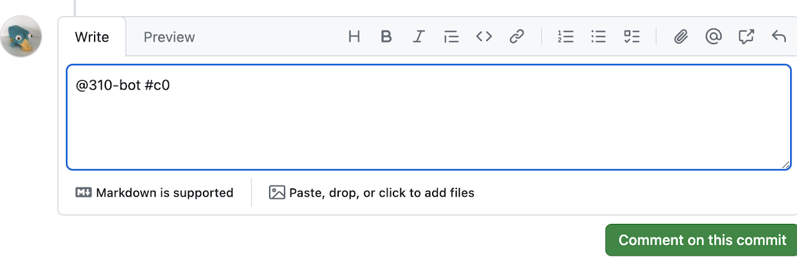

# AutoTest Feedback

AutoTest feedback is meant to help you gauge your progress and to give gentle hints if you are stuck.
It is not meant as a replacement for good software engineering practices like specification analysis or test suite strengthening, nor is it meant to replace Piazza or office hours.

AutoTest feedback is meant help you progress in your implementation by:
1. Letting you know if you are on the right track.
2. Providing hints on where you could work next to improve your implementation and test code.
3. Giving you a stopping point so you can prioritize other work.

It is also meant to guide you to develop software according to learning goals of this course, including:
1. Interpreting a specification,
2. Test-driven development, and
3. Using feature/dev branches (when applicable).

## Submitting work

Your project is automatically graded every time you push or merge to your project's main branch on GitHub.

**Your autograded portion of your deliverable grade is the maximum grade you received from all submissions made before the deadline.**

Note 1: the only timestamp AutoTest trusts is the timestamp associated with a push or merge event (e.g., when a commit is pushed/branch is merged to the git server).
This is the timestamp that will be used for determining whether a commit was made before a deadline (this is because commit timestamps can be modified on the client side, but push timestamps are recorded on the AutoTest server itself).
Make sure you push your work to GitHub before any deadline and know that any pushes after the deadline will not be considered (even if some commits within that push appear to come from before the deadline).

Note 2: When merging a branch into main, **only use the default merge option.**
If you merge using  squash or rebase, the bot will not see a new commit on main and will only provide feature/dev branch feedback.

## Requesting feedback

You can request feedback by **creating a commit comment which mentions the bot and deliverable:**  `@310-bot #<deliverable>`.
For example, the screenshot below shows a student requesting feedback on a deliverable called "c0".
Your can request feedback 3 times per day.
The limit is reset at midnight.

Notes:
- AutoBot only responds to comments made on a commit in GitHub; comments in commit messages or on PRs will not work.
- There is no way to cancel a request once it has been made.
- Calling the bot on a commit that already has the requested deliverable feedback will not consume a request.
- **A project that fails build, lint, or prettier on AutoTest WILL consume a request:** be sure to always run yarn build before committing!
- If AutoTest times out, you will receive a timeout error. A timeout will not consume a request.
- It may take **more than 12 hours to respond** with feedback when AutoTest is under heavy load (typically close to the deadline).

## Receiving feedback

The bot will provide feedback as a follow-up commit comment.
The feedback will depend on the deliverable and potentially whether the feedback was requested for a commit on the main branch.
In general, the feedback will include your overall score as a bucket and potentially a suggestion for which feature request has earned the fewest points.

### Bucket Grades

AutoTest reports your progress using one of the following buckets, based on how completely your submission satifies the requirements:

- **Beginning** [0--54] Submission has just been started, or is otherwise incomplete.
- **Acquiring** [55--71] Submission demonstrates support for basic or rudimentary functionality.
- **Developing** [72--84] Submission demonstrates support for basic and some complex functionality.
- **Proficient** [85--94] Submission implements support for basic and complex functionality.
- **Extending** [95--100] Submission implements most or all requirements and is functional and robust.

You can interpret the reported bucket as an indication of your progress (and the minimum grade your submission received). Your actual score will be reported separately after the deadline.

## Adding unit tests

To avoid any build issues with AutoTest, we recommend adding your unit tests to a separate directory within your `test` directory.
For example, you should add all of your unit tests to `/test/unit/`.