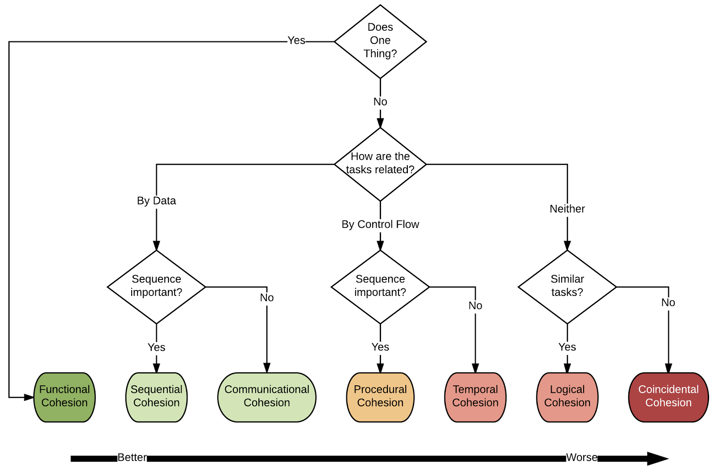
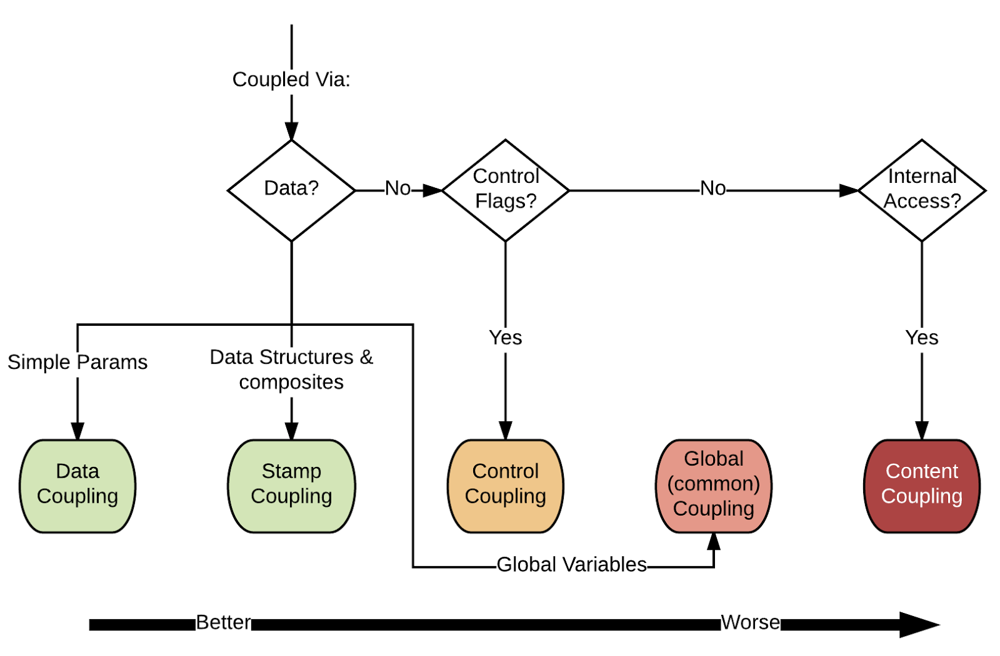

You now understand the cost of making a change, but what parts of code actually contribute to these costs?
We examine two axes by which to analyze code: *cohesion* and *coupling*.

### Cohesion

<Youtube id="oMJNS6mvhQU" />

Cohesion is a property that indicates how focused our program elements are on performing a single complete task. This is best thought of in terms of classes in object-oriented design. In this space, cohesion measures how well the elements within a class belong together. Classes with low cohesion are responsible for a wide variety of tasks; these classes are harder to reason about because they often have many competing concerns within their implementation that might conflict. This can cause maintenance problems because changes to fix one defect within a class might actually be by design for another feature provided by the class. The larger a class grows in scope, the more likely this kind of problem is to be encountered.

Cohesive classes generally have a small set of private fields that make sense to the majority of the public methods within the class; if there are fields within the class that are only used by a small fraction of the public methods it may be a sign that the functionality provided by those methods and the private field may not be cohesive with the overall functionality of the class.

Since cohesive classes are smaller, they lead to a proliferation of classes within a system. While this might make it harder to find the right class within the system, it greatly eases how hard it is to understand that class and simplifies any future bug fixes or feature additions that may be required.

We measure cohesion in terms of the following properties:
1. *Reasons*: the number of concepts are present in a grouping of code
2. *Type*: how a pair of concepts is related (by *data*, *logic*, and/or *timing*)

The table below shows TypeScript examples of code that is related by different *Type*s:

| Type | Example | Explanation |
| --- | --- | --- |
| Data | `const subtotal = price * quantity; const total = subtotal + tax;` | line 2 uses data from the previous line |
| Logic | `if (user.isAdmin) { grantAccess(); } else { denyAccess(); raiseAlarm() }` | `denyAccess()` and `raiseAlarm()` are grouped by the same logic |
| Timing | `clearCanvas(); redrawCharacters();` | `clearCanvas()` needs to be called before `redrawCharacters()` for it to display properly|

Using these properties helps us reason about which code should be grouped together, and which code can be extracted apart.

<!-- The flow chart below can be used to reason about the kind of cohesion within a design. As with the coupling flow chart above, some kinds of cohesion are better than others. Thinking about the cohesiveness of our program elements can help us to understand when further decomposition of our designs might be helpful and will also motivate the organization of our program elements into their most appropriate subsystems.

 -->

<Youtube id="gkCIOUbu81o" />

### Coupling

<Youtube id="I9rEvxiWF9I" />

Coupling is a property that indicates the strength of connections between different program elements. Strong coupling is problematic because it negatively influences the evolvability and maintainability of a program. There are several reasons for this:

* Coupled code makes it easier for errors in one part of the system to propagate to other unrelated parts of the system.

* Coupling increases the degree to which a single bug fix or feature addition is scattered across the codebase.

* Code that is tightly coupled is much harder to reuse independently than code which is loosely coupled.

* It is harder to understand a source code element that is coupled to other elements because individual elements cannot be considered (and understood) in isolation.

We can measure coupling between two groups of code along the following attributes:
- **Degree:** How many connections there are between the groups.
- **Locality:** How far away the groups are from each other.
- **Strength (Connascence):** How strong the bonds are.

 Connascence type | Two things must agree on | Example |
| --- | --- | --- |
| **Name** | What something is called | A `userId` is passed around as a plain string, and several functions expect it to match the naming used by `findUserById`. If one part renames the field or API parameter without updating all call sites, the code still compiles but lookups silently fail. |
| **Type** | The shape of the data | A function receives a tuple like `[customerId, productId, quantity, price]`, and multiple callers assume the same 4-field structure. If one side changes the tuple to include a discount field, the rest of the system keeps working until runtime errors or incorrect totals appear. |
| **Value** | A specific literal | The app hard-codes the string `"pending"` in several places, including validation, reporting, and UI labels. If the status is renamed to `"in-review"`, every location must change in sync or the system shows inconsistent behaviour. |
| **Position** | Argument order | A helper like `createInvoice(customerId, startDate, endDate, total, tax)` is used by several modules. If one caller swaps `total` and `tax`, the code still compiles and tests may pass, but invoices are calculated with the wrong values. |
| **Algorithm** | A computation done the same way | Four different modules each compute a discounted price with slightly different logic: one rounds before tax, another rounds after tax, and a third uses a flat discount. The system appears consistent until a customer sees mismatched totals across invoices, reports, and the dashboard. |

Notes on connascense based on [here](https://practicingruby.com/articles/connascence) which contains more explanations and examples.
Coupling can be either implicit or explicit: for example, a method call or class import is a sign of explicit coupling, while a use a specific "magic" value across the codebase or a duplication of an algorithm is usually implicit coupling.
In general, implicit coupling is more dangerous because it is more difficult to understand if a change is editing the complete scope of the coupled code.

#### Addressing Coupling

It is important to remember that any non-trivial system _requires_ that there be some coupling between elements. The goal is not to eliminate it but to make the coupling be as loose as possible. There are three primary ways to decrease the coupling between program elements:

* **Minimize the number of interfaces (Degree) between elements**: The more interfaces two program elements need to share, the more tightly they are coupled to each other. 

* **Minimize the distance between interfaces (Locality) between elements**: If coupling exists between elements in entirely different systems, consider extracting shared code into a common library that can be independently used in each system.

* **Minimize the complexity of interfaces (Connascence )**: Moving from a connascence of Algorithm to a connascence of Type means that coupled code just needs to adhere to a new type--not fully reimplement an algorithm--to properly evolve. This makes the cost of each change must cheaper.

<!-- * **Avoid control flow coupling**: It can often be convenient to pass objects that control the flow of computation within another element.  While this is ok if the element being passed is some type of data structure, it can be more problematic if the control flow is being influenced by simple control flow flags (e.g., some kind of `boolean` flag that takes one program path over another). -->

<!-- The flow chart below can be helpful for reasoning about the coupling between program elements. One thing to note is that not all coupling is equally detrimental: coupling elements by simple data types is less problematic than coupling them through global variables (common coupling) or internal field access (content coupling).

 -->

<Youtube id="QZAacpnjVVg" />

<!-- TODO: describe levels -->

## Design Symptoms
<Youtube id="_Eb5bAgpgQg" />
<!-- TODO: cognitive dimensions -->

<!-- TODO: describe levels -->

<!-- TODO: include design guidance and symptoms -->
<!-- rigidity, fragility, immobility, viscosity, complexity, repetition, opacity -->
