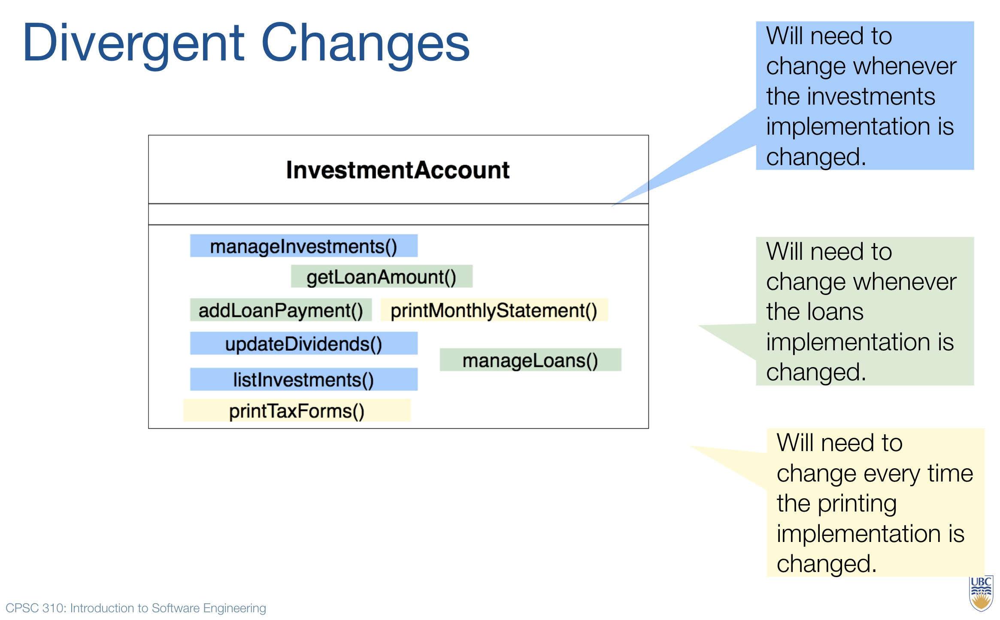
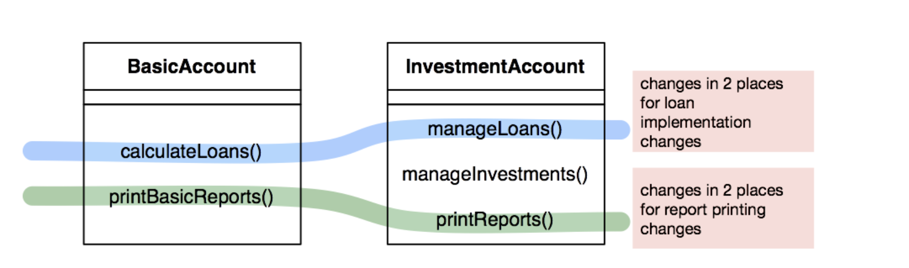
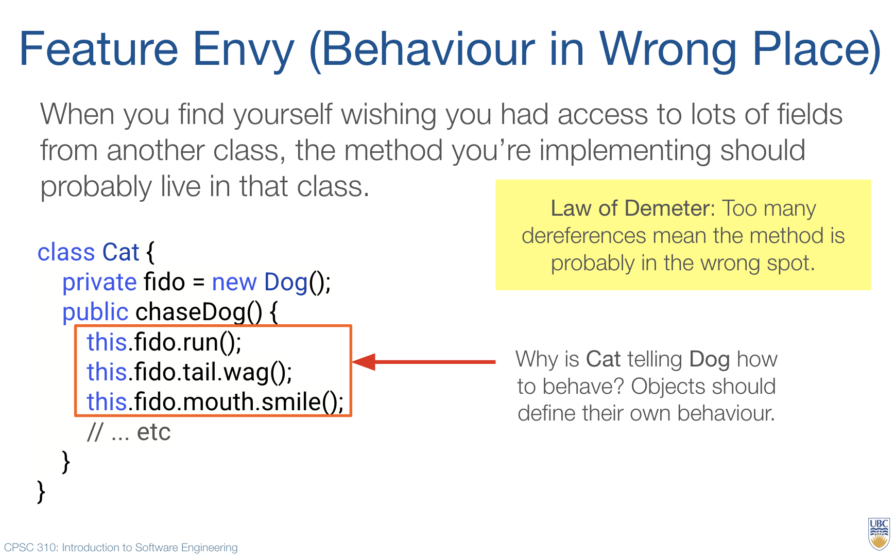

Software engineering is unique among engineering disciplines in that change happens constantly--not once a year, month, or even week.
Modern software teams may deploy user-facing updates by the minute or hour.
Requirements change frequently, and the code must be easily amenable to evolution to accommodate.

## How much does that change cost?

You may have made a code change before and thought to yourself: "Gee, that was harder than it should have been!".
In other words, that change *costed* you more effort to implement.
But how do we measure cost?

One way to do it is to examine *magnitude* and *footprint*:
1. **Magnitude**: measures how large a change is (usually in terms of lines of code).
2. **Footprint**: measures how widespread a change is (how many methods, classes, files, modules, or services a change touches).

Between the two of these metrics, **footprint** is more indicative of difficult-to-evolve software.
Consider the scenario where your teammate creates a 500-line-of-code change.
Those 500 lines of code must be added to your codebase somehow, would you as the reviewer prefer that they are added to one new file, or divided among eight different ones?
If it was divided among eight different ones, how likely is it that there actually is a *ninth* file that needed to be edited but was missed?
And if a similar feature request comes along later, you will need to remember all these places to update!
Another way to view this is via *conceptual drift*: we have a *concept* that we want to represent in code (e.g. an algorithm to calculate interest, a way to represent a customer account, or a process for updating a package's tracked location) and a change with high footprint indicates that this concept is spread out across our codebase.

This is the intuition behind why typically we typically consider the footprint of a code change to be more costly than its magnitude.
We incur these costs every time we want to update the code.

## Code Smells

Code smells are ways to articulate the shape of commonly encountered costly code changes:

### Divergent change
Divergent changes occur when one class is commonly changed in different ways for different reasons. 
Any change to handle a variation *should* change only a single class, and that class should capture the unique variation.
Divergent changes are one symptom that a class is trying to represent more than one concept.
This is costly because although the change may be isolated to one class, it may require the developer to either comprehend or edit many parts of that class (high method footprint).

### Scattered change
Opposite to divergent change, scattered change arises when simple coherent changes require broad changes across a system. 
Scattered changes are indicative that a concept is unnecessarily spread out throughout the codebase, meaning that every time that concept is edited, the cost of the entire footprint is incurred.

### Feature envy
This is a broader code smell that occurs when a method is in the wrong class. Law of Demeter violations commonly signal feature envy smells. The Law of Demeter states that a program component should have limited information about other components in the system. These violations are usually easy to spot and arise when a function 'reaches into' another function to tell it how to behave. For example, if a method called `db.getResults().sort().print()`, not only does it know about `db` but it also needs to know about the return types to `getResults()` and `sort()` in order to call methods on them. 
Feature envy can be incurs a high comprehension footprint even if a change ends up having small magnitude because the developer may spend unnecessary time trying to find the correct place to edit.
Feature envy can be an indicator that code is owned by the wrong class, or that there is unnecessary abstraction.

