<Youtube id="BHFk5yt_DEs" />

Several design patterns are described below.
A design pattern is a description of a common usage of language tools to solve structural problems in code.
The purpose of a design pattern is not to classify code (e.g. to say code is or is not a particular pattern) but to equip you with more complex ways of using language features to structure code.
Each design pattern interacts with parts of analytical code design (i.e. coupling, cohesion, and testability).

<!-- ## Observer: Simplifying state update notifications.

When a user makes a change to a program, they expect the change to be consistently reflected across the entire system. For example, if you delete an image file from a photo viewer, one would expect the thumbnail to disappear, the photo to be removed from the gallery view, and the total number of files in the status bar to be updated to reflect the deletion. A poor initial design for this problem can be seen in the figure below. While for this one action this design might not seem like a big deal, for a real application with hundreds of actions and dozens of views, the design could require dozens of classes to be modified each time a new view was added.


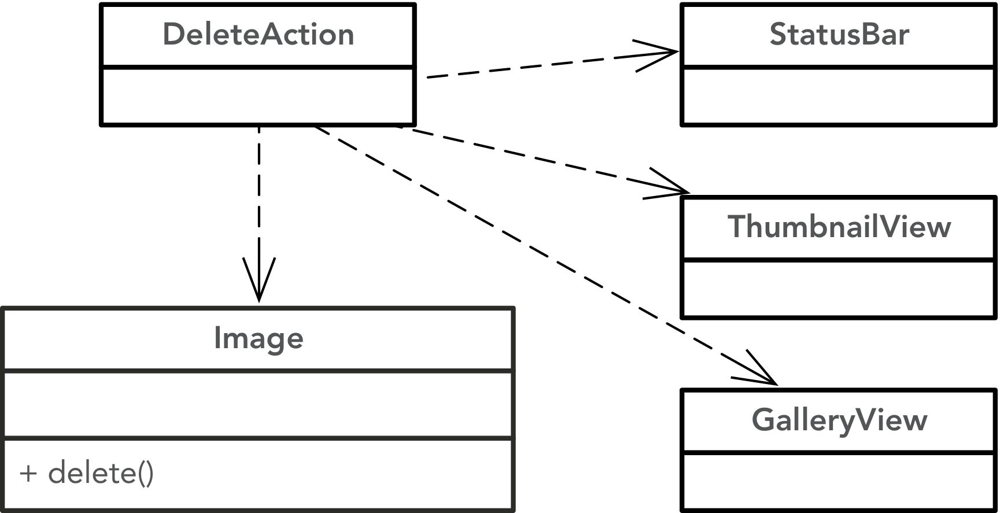

Ultimately a designer would like to decouple the state changing actions in the system from how they are reflected by the other components. The observer pattern enables this decoupling by leveraging dependency inversion to implement a mechanism commonly known as [inversion of control](https://martinfowler.com/articles/injection.html). While a traditional program calls the components it uses (e.g., your program calls methods in a library), inversion of control provides a means for a library to call _into_ your code. 

For our image deletion example, `Image::delete()` calls `Subject::notify()` which iterates through its `observers` list and calls `update(this)` on all of them so they know that an object they are interested in has changed state. Each `Observer` can then react accordingly. This design means that the `Observable` classes are not coupled to any concrete `Observer` objects, making it so new `Observer` classes can be added to the system at any time. The system is also dynamically efficient because `Observer` objects can be dynamically added (and removed) from observable objects as needed by the system. 

In this system, many different model elements would likely be `Observable`: PDF files might render differently in the gallery view when they are selected (to allow access to different pages of the document) or folders might give some hint about their contents in their thumbnail representation. The value of the observer pattern becomes clearer as the number of observable and observing classes grows.

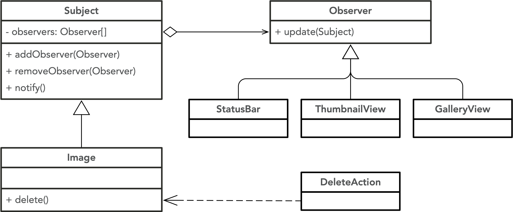

It is important to note that there is still _some_ coupling in this design: observable objects must know about the `Observer` interface so they know how to notify their observers, and all observers must know about the objects they are observing. But one crucial aspect of the coupling is removed: the `Observable` objects do not know anything about the concrete subtypes of `Observer`. This means new observers can be dynamically added to an object at runtime (for instance if a new view was opened in a user interface), or the system could be extended by adding a new subtype of `Observer` without changing any of the model elements that the new observer might want to watch for state changes.  -->

<!-- TODO: push vs pull observation -->


<!--

### Observer

The observer design pattern enables one-to-many relationships between objects to be easily captured in code. The pattern also enables these relationships to be dynamically modified. The primary benefit of the pattern is that subjects that are being observed remain oblivious of the objects that are watching their changes. 

This pattern has one major design choice that needs to be made: whether the observers are _pushed_ the specific changes made to the subjects or whether they have to _pull_ them. In the push model, the subject calls `notify` with some representation of a change (e.g., in our example the `notify` call might be accompanied with the ball's position). This model assumes the Subject can always know the right data to send with the update.

In the pull model, the `notify` call is instead accompanied by the Subject itself (e.g., in `Ball::stateChanged()` there would be a call `this.update(this);`). This enables the Observers to query the Subject to understand how it has changed, but requires that the Observers also know about the Subject's interface.

The `Subject` class often implements the add/remove/notify methods directly, but could itself extend a more generic base class that provides these features (e.g., the Java `Observable` class).

In the example below, the `Ball` remains unaware of the number, or composition, of the observers that are watching its updates. Whether one player is playing haki sack or 22 players and 3 refs are involved in a full game, the ball is oblivious. 
The example below uses the pull model: the `notify` call includes the `Subject` object so changes can be pulled.


-->

<!--
Game analogy
http://www.codeproject.com/Articles/12183/Design-Your-Soccer-Engine-and-Learn-How-To-Apply-D


-->

## Patterns for establishing interfaces


## Adapter: Simplifying interactions with incompatible types.

The Adapter pattern is widely used, especially in the context of legacy systems that cannot be easily modified, to enable objects to more easily interact with each other. Adapters often act as translators, enabling the objects and implementations used in one design to be converted to a format that is more amenable to another design. While adapters are often relatively straightforward, if the differences between the two designs is large, they can become more complex.

In the most common cases, Adapter objects simply act as a wrapper for another object. Concretely: the adapter contains a field of the wrapped type, and exposes a set of methods that make sense for a given design. Any requests to these methods are then _adapted_ to the interface required of the adapted object. This often involves transforming both the parameters to invoke the wrapped object as well as transforming any returned values to match the exposed interface.

The main benefit of the Adapter pattern is that it allows clients of the adapters to remain oblivious of the design of the wrapped object, while still taking advantage of its functionality. Although client objects could do these translation steps themselves, they would then be coupled to the wrapped object and would have to take on the responsibilities necessary to perform the translation themselves.

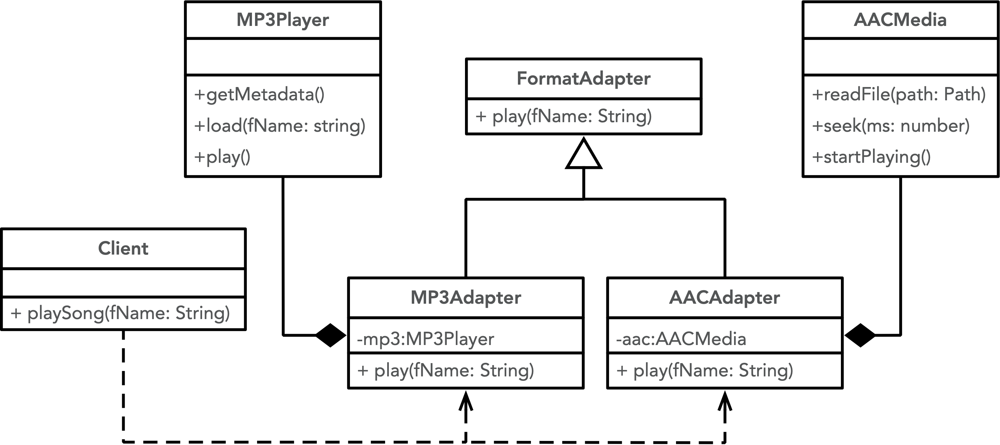

In the example above, the `Client` needs to use functionality from the `MP3Player` and `AACMedia` frameworks, neither of which they are able to directly modify. But they would like them to have a consistent interface, despite the fact that they both have different requirements for actually performing the action (executing `play(fName: string)` that the `Client` actually wants). The adapter objects each only know how to deal with their adapted type to provide the desired functionality. While in this example both Adapters implement `FormatAdapter`, this is not strictly required by the pattern.

### Analysis
Consider the client code without the adapter pattern.
Any updates to how the client wanted to interact with the song (for example, if they wanted to implement a "skip" button) would need to be duplicated for however each media type handled it.
This indicates a tight implicit coupling, with a connascence of algorithm.
By adding an adapter class, the client now only has a connascence of type with any `Player`s: each player only has to adhere to a type interface for a client to use it.

## Factory: Creating objects.

The design advice _depend on abstractions, not implementations_ is widely used, but it is impossible to instantiate an abstraction. An object must be created before it can be used, and when an object is created we must reference (and be coupled to) the exact concrete implementation that we want to have a reference to. Creational design patterns provide a means for enabling the creation of objects to be encapsulated within a specific object. While this object will have to know about the concrete types they are creating, they allow their callers to depend on their abstractions (assuming the instantiated objects have a more meaningful supertype). Providing a means for client programs to remain oblivious of the concrete types they are using is crucial to enable the open/closed principle to be applied fully within a design. 

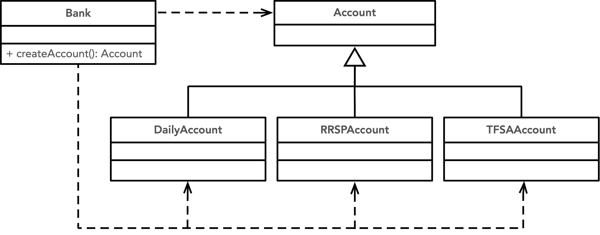

In the class diagram above, we can see the shortcomings of the factory-less design as `Bank` is coupled to all three subtypes of `Account` so that it can instantiate the kind of object it needs, despite maintaining a reference to `Account` itself. 

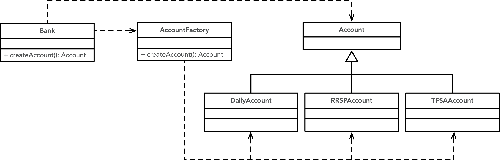

The above design has been improved by having the `Bank` depend on a `BankFactory` instance. In this way the `Bank` remains oblivious of the concrete implementation of the `Account` they are using. This design does have some drawbacks though: every time a new `Account` is added the `AccountFactory`, which all clients depend upon, will need to be modified.

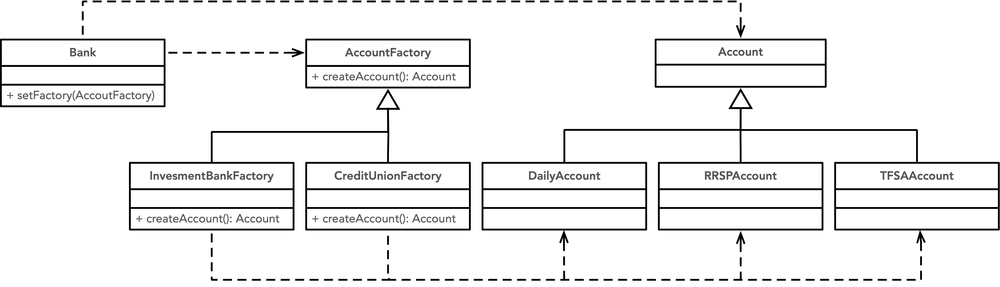

This final design is called an _Abstract Factory_. In this design the client code depends on a factory that itself implements an `AccountFactory` interface. This means that the client can be specialized with the kind of factory that is relevant to them. It also means that as new types of `Account` are added, only the factories that the new `Account` is relevant for need to be modified.

```typescript
// Product Interface
interface Account {
  generateInterest(): number;
}

// Concrete Products
class DailyAccount implements Account {
  generateInterest(): number {
    return 0.01; // 1% interest rate
  }
}

class RRSPAccount implements Account {
  generateInterest(): number {
    return 0.04; // 4% interest rate
  }
}

class TFSAAccount implements Account {
  generateInterest(): number {
    return 0.03; // 3% interest rate
  }
}

// Abstract Factory
abstract class AccountFactory {
  abstract createAccount(): Account;
}

// Concrete Factories
class InvestmentBankFactory extends AccountFactory {
  createAccount(): Account {
    return new TFSAAccount();
  }
}

class CreditUnionFactory extends AccountFactory {
  createAccount(): Account {
    return new DailyAccount();
  }
}

// Client Context
class Bank {
  private factory?: AccountFactory;

  setFactory(factory: AccountFactory): void {
    this.factory = factory;
  }

  openAccount(): Account {
    if (!this.factory) {
      throw new Error("No AccountFactory set.");
    }
    return this.factory.createAccount();
  }
}

// Usage Example
const bank = new Bank();

// Configure with InvestmentBankFactory
bank.setFactory(new InvestmentBankFactory());
const investmentAccount = bank.openAccount();
console.log(`Interest Rate: ${investmentAccount.generateInterest() * 100}%`); // Output: Interest Rate: 3%

// Switch to CreditUnionFactory
bank.setFactory(new CreditUnionFactory());
const creditUnionAccount = bank.openAccount();
console.log(`Interest Rate: ${creditUnionAccount.generateInterest() * 100}%`); // Output: Interest Rate: 1%
```

### Analysis
Without the factory pattern, we would need a method in `Bank` that looked like this:

 ```typescript
 openAccount(): Account {
    // Direct coupling and conditional logic to create concrete objects
    if (this.institutionType === "InvestmentBank") {
      return new TFSAAccount();
    } else if (this.institutionType === "CreditUnion") {
      return new DailyAccount();
    }
    
    throw new Error("Invalid or unselected institution type.");
  }
 ```

This introduces a tight coupling between `Bank` and concrete `Account` instances.
This primarily impacts our testability: it becomes difficult to create test fakes for `Account`s since our code violates the dependency inversion principle.

## Strategy: Encapsulating algorithms.

<Youtube id="1MJ_Lj8mebU" />

The Strategy design pattern enables encapsulation of algorithms. This lets client programs depend on the algorithmic interface without having to depend (or know about) the concrete underlying implementation being used. This allows new algorithms to be easily defined and added to a system without changing any client code.

The strategy pattern is often used to avoid subclassing the client. In our example below, you could imagine `Client` being extended by `CelsiusStrategy`, `KelvinStrategy`, and `FahrenheitStrategy`. While this would work, it would mean that `Client` would have to be changed to add a new form of temperature conversion. The pattern also supplants the even simpler approach whereby the code would have a series of conditional statements to choose the right temperature multiplier (which would also require `Client` changes to extend):

```typescript
if (tempScheme === 'C') {
  ...
} else if (tempScheme === 'F') { 
  ...
} else if (tempScheme === 'K') {
  ...
} else {
  ...
}
```

### Analysis
In this code, any edits to the usage in the client would exhibit Scattered Changes across each of the conditional bodies.
This is indicative of code that is tightly and implicitly coupled, with a connascence of algorithm (because the client code duplicates a processing algorithm).
By implementing a `Strategy` interface, the client now only depends on a type (achieving the weaker connascence of type), and future changes including new strategies, and to the processing code, now only happen in one place.
This also improves testability: instead of having to test the whole code by repeating tests except by varying `tempScheme`, we can individually test each strategy, and then write just one test that tests the *integration* of just one strategy and the client's processing code, more easily controllable if we use a `FakeStrategy`.
This could improve either `observability` or `controllability` or both!

<!-- In general, strategies are fairly constant at runtime (e.g., the concrete type of the underlying strategy will not frequently (or ever) change once it has been set). One challenge with the strategy pattern is that the client needs to know about the available strategies to be able to instantiate the one they are to use, although factories or dependency injection can play a role here to help insulate the client from this instantiation step.  -->

<!---
go with temperatures:

http://www.codeproject.com/Articles/13229/Implementing-Observer-Strategy-and-Decorator-Desig


-->

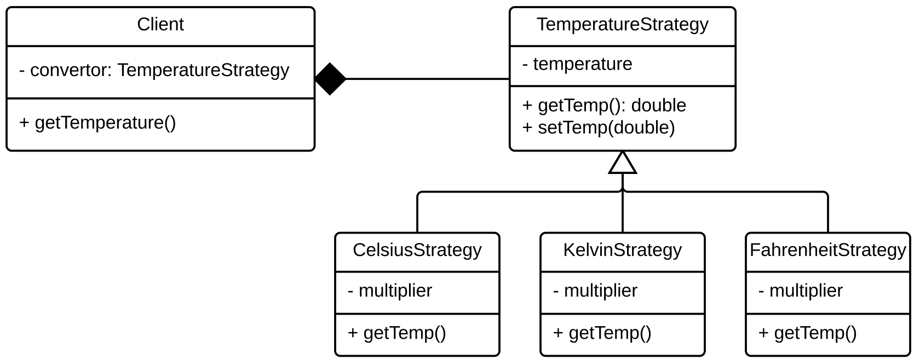

## Patterns for delegation


## State: Dynamically changing behaviour based on internal state.

<Youtube id="uB4OQ4Am3Rw" />

The state design pattern provides a composition-based approach for clients to manage their behaviour dynamically as their internal state changes. The current state of the system is dictated by a reference to a state object; the reference is dynamically updated as conditions change. Rather than having one large `if` or `switch` statement controlling state transitions, transition decisions are left to the state objects which only need to reason about their valid transitions, not all global transitions. 


<!--
From: https://jklunder.home.xs4all.nl/elisa/part05/Design%20Patterns/State.html

also cool: http://gameprogrammingpatterns.com/state.html


-->

In the diagram below, `TCPState` objects use their reference to `TCPConnection` to call `setState(TCPState)` as the state of the system changes. In this way the client (`TCPConnection`) always knows its current state without being responsible for making sure it is correct. As the client performs actions on its `state` object, that object can itself update the client's `state` in response to any action. In this way the client delegates the responsibility for managing state transitions to the state hierarchy.

The state pattern isolates state decisions which makes reasoning about how or why these transitions took place much easier (for example because one could add logging to `setState(..)` in a way that would be opaque if the state was determined by examining values in fields within the system). This typically simplifies state management as well as from any given state there is a subset of valid other states that the program could transition to; this means the transition code is much simpler than a global block which must consider all possible transitions. 

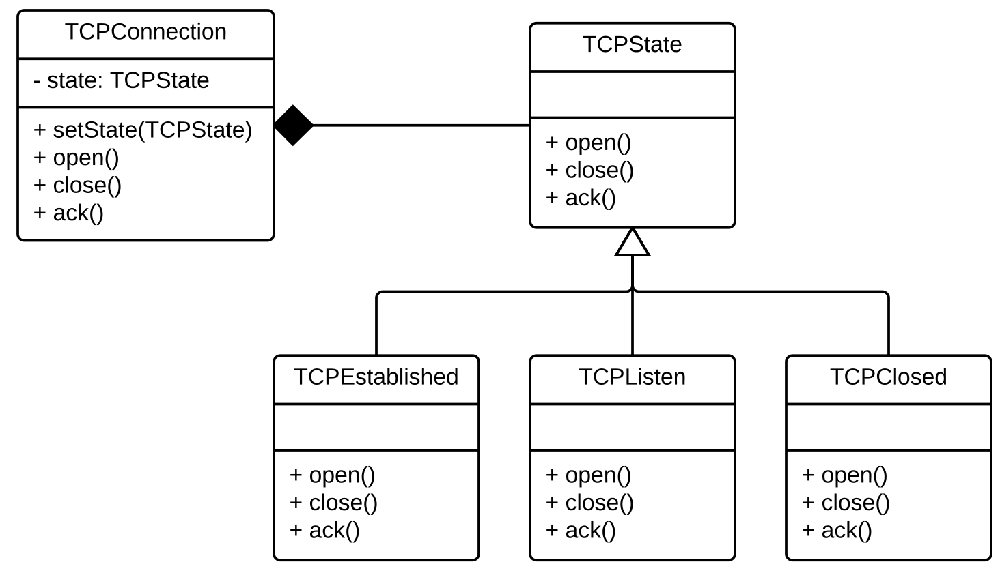

<!-- For example, the client could avoid change-prone brittle control flow like the following (this is a subset of what would be required in the example): -->


### Analysis
Without the state pattern, the code could look something like this:

```typescript
if (last === null || last === '') {
  handleClosed();
} else if (last === 'listen' && isOpen()) {
  handleOpen()
} else if (last === 'established' && isClosed()) {
  handleClosed();
} else if (last === 'listen' && isClosed() {
  close();
}
```

The main problem with this code is low cohesion: the parent class must deal with all its normal responsibilities in addition to managing the logic for each state and state transition.
This may result in *divergent changes*: any edits for seemingly unrelated requests may end up touching code in similar locations in the parent class.
Secondly, consider wanting to add something that affects each state transition (e.g. logging the current and next state for each transition).
This results in *scattered changes* (and indicate a connascence of algorithm between state changes).

By implementing the state pattern, we solve both of these problems:
1. by delegating all state-related logic to a separate class, we improve cohesion in the parent class.
2. by centralizing the logic, we can utilize inheritance to implement shared changes exactly once.

These benefits can also be framed in terms of testability. Let's first consider *controllability*.
In order to test the second conditional case that results in `handleOpen()`, we would need to get the parent class into a state where `last === 'listen'` and `isOpen()`.
We would also need to do this for every other possible state and transition, no matter how complex it would be to get there.
However, if we had a `ListenState` class, each test already assumes that it starts in the state of "listening" (with no setup required) so we just need to test each transition separately, and by testing each `State` class like this, we have fully tested our system by transitivity.


<!-- ### Comparing Strategy and State

<Youtube id="Ccpg656MUxE" />

Clearly the State and Strategy patterns look structurally identical. And, except for the `setState` method and the fact that every state object has a reference to its context (so it can call `setState`) they are identical. The difference lies more in the _intent_ of the pattern. Strategies are fixed at the start of execution, whereas the States change repeatedly and often during runtime. This distinction further reenforces that the most important aspect of patterns is not their structure and form, but what they _do_ and how they promote encapsulation and evolution within the system.  -->

<!--
TODO: extend with statechart-based example & code from more than one state vs global state.
-->

<!-- 
student submitted links
https://www.youtube.com/watch?v=MGEx35FjBuo 

with before/after code:
https://sourcemaking.com/design_patterns/state/java/1
-->


<!-- ## Facade: Making common tasks easy.

<Youtube id="MdMaHrKQBsU" />

The Facade is a structural pattern to provide a unified set of interfaces for a subsystem. Subsystems can contain a large amount of code that even if well designed can be difficult for a client to learn to correctly use. Facades provide coherent simplifications of modules for performing common tasks. It is not uncommon for a subsystem to have multiple facades for different client use cases. Facades are usually easy to implement once you have a complex subsystem that you want to provide a more unified high-level interface to. 

One important note is that while a facade can simplify a subsystem, it does not prohibit clients from accessing features within the subsystem directly. Facades are mainly a pattern of convenience to make it easier for clients without restricting their options; however, if a client does only use the facade to access the subsystem they are also more insulated from structural changes within the subsystem as only the facade itself should have to be updated to support these, rather than the client themselves. One way to think about facades is that they essentially insert a layer into the design between the client and the subsystem. In architectural terms this is a 'non-strict' layer, since the client can bypass the facade to access the internals. -->

<!--

-->

<!-- Consider the following `WebmailClient`. This class is tightly bound to all of the subsystem code; if it wants to compose an email with an attachment or an appointment it needs to collaborate with many different classes. The author of `WebmailClient` is almost certainly a different developer than the creator of all of those classes so they need to learn a large set of APIs (both which APIs to all, and in what order) to complete their task. Additionally, any changes to those APIs could impact their code; since there are so many direct dependencies the chances of a change impacting their system is not small.

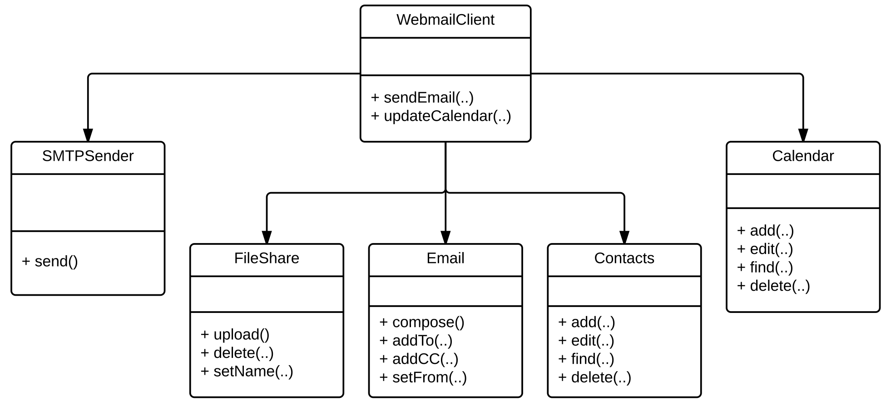

To ameliorate this, they talk to the developers responsible for the PIM code and ask them to create a Facade that is easier for them to use for these common tasks. The PIM owner creates `PIMFacade` that hides the internal details of the PIM subsystem and allows `WebmailClient` to have only a single dependency. This decreases coupling between the client and the PIM classes, and adds a layer of abstraction so the PIM subsystem owner can simply update the `PIMFacade` if any of their internal classes change in a way that could propagate to the client. This both simplifies modification tasks for the owner of `WebmailClient` as they are insulated from these changes, but also for the owner of `PIMFacade` because they know they can make larger changes as long as they do not need to change the facade API.

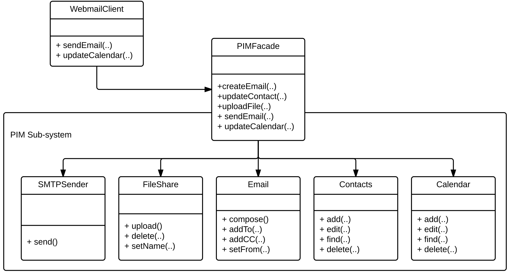 -->

<!-- ## Singleton: Ensuring only one of an object exists.

<Youtube id="V_WbZClazDw" />

It is not an uncommon design constraint to only want to have one instance of some kinds of objects. The Singleton design pattern exists to fulfill this role. The Singleton is also a creational design pattern as it is involved with mediating the creation of an object. While the Singleton is relatively widely used, it is frequently misused and its shortcomings should be understood before choosing to adopt this pattern.

Singletons are the simplest pattern in practice (although more care is required when implementing the pattern in languages that allow true multi-threading):

```typescript
class Database {
	private static instance: Database | null = null;
	private constructor() { }
	public static getInstance(): Database {
		if (Database.instance === null) {
			Database.instance = new Database();
		}
		return Database.instance;
	}
	// rest of Database
}
```

The `private constructor()` declaration ensures that nobody can instantiate a `Database` except for the `Database` itself. By checking to see if the `static instance` has been assigned before creating the instance, the class is able to ensure that only one copy is ever assigned. The pattern is extremely easy for other types to use, as they simply need to call `Database.getInstance()` to get an instantiated reference to the same instance of a `Database` as all other clients are using. Of course, this also highlights one of the key shortcomings of the Singleton: the Singleton itself acts as a global variable because every class in the system has the ability to get a reference to this type. This ease-of-access tends to lead to undisciplined use of Singleton types, leading to concrete references (because all client references must reference the static `getInstance()` method which must be declared on a concrete type).

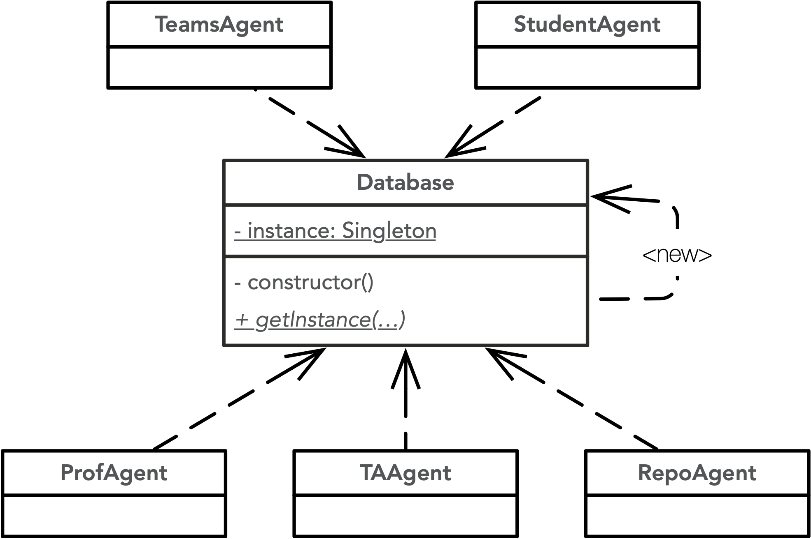 -->

## Decorator: Dynamically adding responsibilities to objects.

<Youtube id="la2Jzb8jmqo" />

The Decorator pattern is another structural pattern that provides a means to dynamically augment an object's responsibilities. With the decorator pattern it is important to distinguish between an _object_ and a _class_. A class is the structural template from which object instances are created. That is, an object is a single instance of a class and a class can have many different instances. Each object can have different field values, but the fields, methods, and parent types they have are all defined by the class they are instantiated from.

The decorator pattern exists to add new responsibilities to _objects_, instead of to their whole _class_. This means that two objects instantiated from the same type can be modified at runtime to behave differently. Decorators work by enabling objects to be wrapped in other objects and using composition to treat the wrapped object as if it were a single object.

<!--

-->

For example, consider the following simple system where we can have a `Car` or three special versions of with additional features:

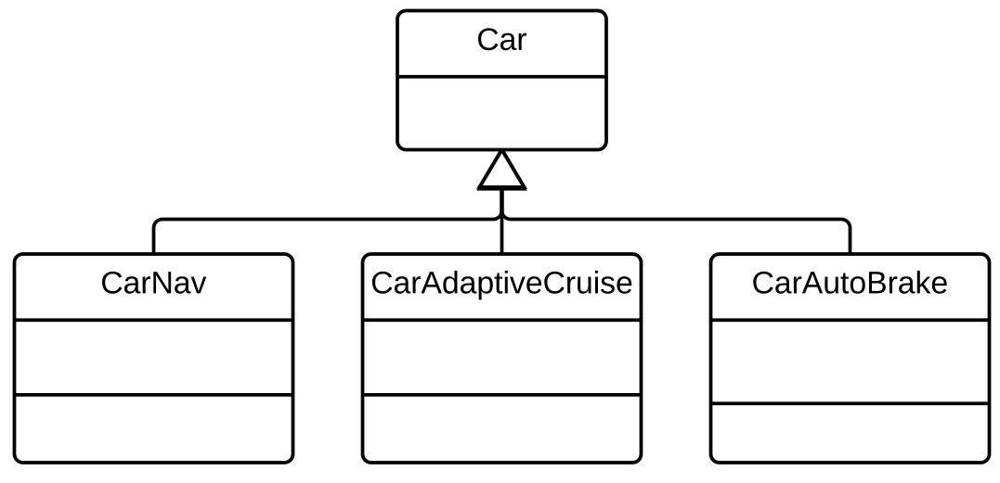

One day a new customer asks for a car with both nav and adaptive cruise control. Planning ahead, the team realizes it is only a matter of time before customers ask for any subset of these features and set out to extend their design in the way that best preserves their existing design:

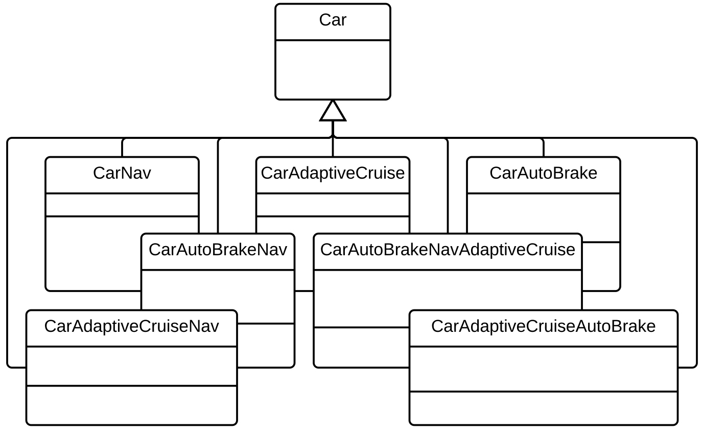

While the above approach is conceptually consistent with the initial design, having seven subclasses of `Car` is not optimal and will surely cause extreme resistance to any new feature being added (for example `CarAutoLights`) as this will have to be mixed in with every existing subclass. Instead, the team decides to move to a system using a decorator, which enables a `Car` to be 'wrapped' in instances of `CarDecorator` to add additional features; this is great, because adding a new features means just adding a single extra class meaning the development team can go home for Christmas after all:

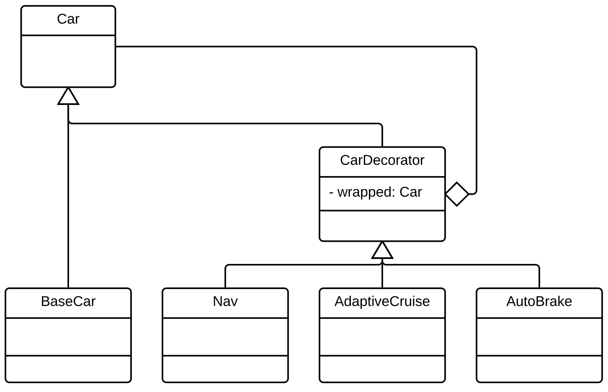

It can be hard to visualize what this means from the class diagram alone. To create a version of a car with Nav and AutoBrake, one only needs to do the following:

```typescript
  let car = new Nav(new AutoBrake(new BaseCar())));
```

Even at runtime this could allow for additional features. For instance:

```typescript
  // create car with Nav off
  let car = new AutoBrake(new BaseCar()));

  // ... sometime later:
	
  // turn on Nav, wrap existing object
  car = new Nav(car);
```

<!--
  TODO: this really needs some methods to work. Unfortunately, this isn't a great example because common methods between Nav and AutoBrake beyond 'on', 'off', and 'diagnostic' are limited.
-->

The decorator does have some downsides: it is impossible to control the 'order' of the wrappers with the pattern. This also means that the wrappers cannot interact with one another directly (e.g., above we could wrap a `BaseCar` with `Nav` twice, which doesn't make any sense). Also, decorator objects tend to be fairly small resulting in a large number of classes. Decorators also interfere with object identity, so code that relies on checking identity (e.g., with `instanceof`) will behave differently with wrapped and unwrapped objects.

### Analysis
Ultimately the decorator pattern provides excellent support for maintaining the flexibility and extensibility of the system.
Base classes can be kept simple focusing on their core responsibilities (single responsibility), while additional functionality can be implemented in decorators (open/close).
This makes each class embody high cohesion.
This also means adding new decorators is easy and does not change the base classes, meaning that the classes are more loosely coupled together. 
This is a textbook demonstration of the flexibility of composition over inheritance. 

## Composite: Consistent handling of part-whole relationships.

Composites provide a mechanism for treating groups of objects the same as individual objects (often known as part-whole hierarchies). Systems often start with individual objects, but over time gain the ability to group objects together. Adding logic to differentiate individual objects from group objects adds unnecessary complexity to code. The composite pattern, through the composite (`Manager` in the example below) uses composition to maintain a list of children while still itself being the parent component type (`Employee` below). 

The introduction of the composite  means any client can treat both managers and developers as employees (e.g., by asking for their names or ids uniformly), whether they have reports or not. This frees client code from checking if the `Employee` reference they have is a `Manager` or a `Developer`, and enabling a `Manager` to appropriately traverse all of their reports appropriately (even if some of their reports are themselves a `Manager`).

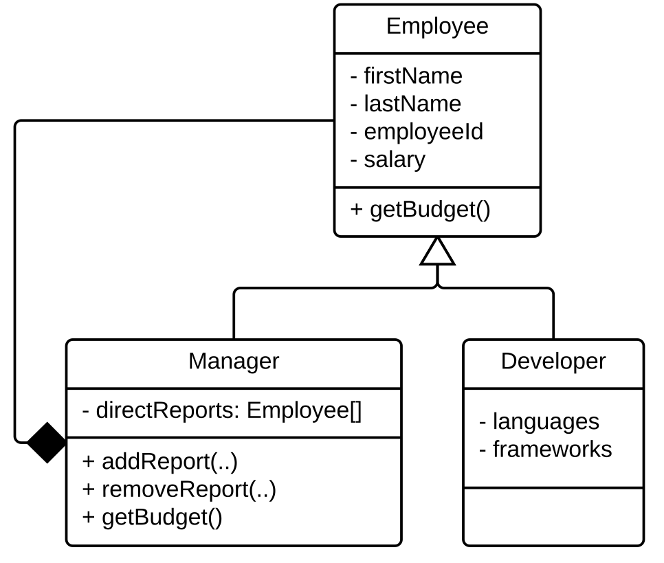

### Analysis
Without the composite pattern, any changes to how the client wants to handle employees would have to be duplicated in each type of employee.
Additionally, adding a new role such as `TechLead` which, like `Manager`, has direct reports to traverse, would mean a duplication of this traversal logic.
Both of these issues result in the code smell of *scattered changes*, indicating a strong coupling (connascence of algorithm).

The composite pattern decouples these implmeentations by taking it down to a connascence of type (especially visible in the client code).
In the example, the default implementation of `Employee::getBudget()` would just be:

```typescript
public getBudget():number {
  return this.salary;
}
```

Meanwhile, the implementation of `Manager::getBudget()` would also capture the budget of their reports (some of whom could themselves be `Manager`s):

```typescript
public getBudget():number {
  let budget = this.salary;
  for (const report of this.directReports) {
    budget += report.getBudget();
  }
  return budget;
}
```

But to the client whether an employee is a `Manager` or `Developer` would be totally transparent.

```typescript
// employee 1233 has no reports
const e1 = getEmployee(1233);
Log.info(e1.getBudget());
	
// employee 1234 has 4 direct and 35 indirect reports
const e2 = getEmployee(1234);
Log.info(e2.getBudget());
```

<!--

-->


<!-- ## Visitor: Localizing data structure traversal.

The visitor pattern enables operations to be performed on an object hierarchy without directly modifying the hierarchy itself (either by adding new classes or methods). The primary motivation for the pattern is that given a large set of objects it is often necessary to perform tasks on them that is not a part of their core responsibilities; this pollutes their classes and adds non-essential code to their classes that is spread across all classes. By providing an external mechanism for performing these tasks, the visitor extracts the code from the class hierarchy itself, while also bringing together all of the code for that task that would otherwise be spread across the object structure.

The visitor does require one new method be added to every class in the structure being traversed, which is a method called `accept(visitor: Visitor): void`. While this is a change to the objects, all future visitors will work with this API, enabling additional visitors to be added transparently to the system. The pattern acknowledges that the tasks we want to perform _on_ a set of objects vary much more often than the core responsibilities of the objects themselves, so paying this one-time cost to enable future extensibility is often worthwhile. The `accept` method is responsible for managing the iteration over any of its child or composite components are called appropriately as well as for calling the visitor itself. One thing to note is that in languages that allow overloaded methods that vary only in parameter type, the `Visitor` implementations typically have multiple methods called `visit(<type>)` that only vary in the type of the parameter. This does not work in a language like TypeScript; usually methods will be called `visitFoo(..)` or `visitBar(..)`, etc. to differentiate between the different `visit` methods.

For instance, in the diagram below one could imagine adding `numReports` or `topLangs` methods to `Manager` and `Developer`, but instead we have created a `TopLangsVisitor` and `NumReportsVisitor` which both traverse the hierarchy directly. Each `accept(v: Visitor)` method immediately calls `visitor.visit` which uses dynamic dispatch to call the right visitor method. The method within the visitor can then interrogate the provided object to retrieve the required information and maintain a running tally of the answer that can be reported after the traversal is complete (the visitor can accumulate state in its own fields). Note, `Manager::accept(Visitor)`  would be slightly different (e.g., each object will ensure that its correct children (or composite components) are visited appropriately):

```typescript
public accept(visitor: Visitor): void {
  for (const report of this.directReports) {
    report.accept(visitor);
  }
  visitor.visit(this);
}
```


While adding new visitors is easy, adding new concrete types to the type hierarchy is hard. This is because every visitor needs a `visit` method for every type that is being traversed which could result in many visitors being impacted. Also, due to the runtime operation of the visitor being dictated by dynamic dispatch, it is often challenging to understand how the visitor works, if a problem is ever encountered.

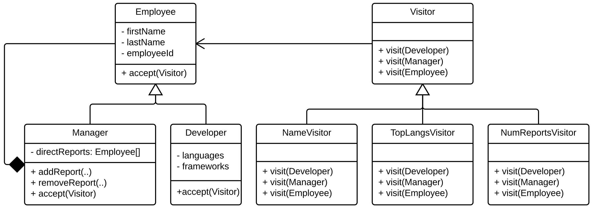 -->

<!--

-->


<!--
Dropped due to lack of time:

### Command


### Builder


-->


## References

There are a vast set of resources about design patterns, the following are only a rough starting point:

* https://refactoring.guru/design-patterns

* Great overview of [most](https://sourcemaking.com/design_patterns) design patterns with concrete examples.

* Repository of [many design patterns](https://github.com/torokmark/design_patterns_in_typescript) implemented in TypeScript.

* Interesting article on language-specific support for [decorators](https://dzone.com/articles/is-inheritance-dead).

* Nice [state pattern](http://gameprogrammingpatterns.com/state.html) article.

* [Design Patterns: Elements of Object-Oriented Software](https://www.amazon.ca/Design-Patterns-Elements-Reusable-Object-Oriented/dp/0201633612) (Gang of Four Book).

* [Head First Design Patterns](https://www.amazon.ca/Head-First-Design-Patterns-Brain-Friendly/dp/0596007124/ref=sr_1_1?ie=UTF8&qid=1541463656&sr=8-1&keywords=head-first+design+patterns)
