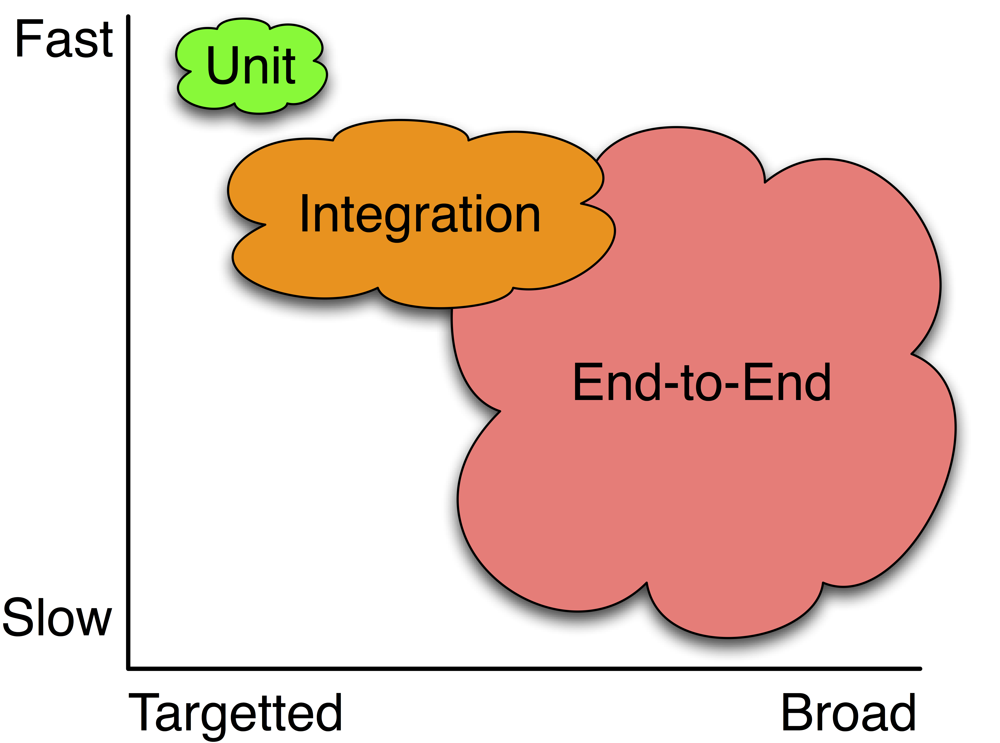

Back in chapter 2 we discussed testability of code in terms of its *controllability* and *observability* where we focused our analysis on individual methods and test cases.
Now we will discuss the *automatability* of a test case, which informs the efficacy of a systems' whole test *suite*.

### Motivation
A test suite should be able to be easily automated: fast, deterministically, without consequences, and able to be executed in parallel.
Below are some common factors present in software that cause risk toward automatability.

| Automation Risk | Example |
| --- | --- |
| Speed | File I/O, network calls, expensive algorithms |
| External Reach | External libraries or APIs | 
| Non-determinism | Clocks, random numbers |
| Costly effects | Payments, foreign APIs |
| Shared State | Databases, global variables |

For example, consider the following code:

```typescript
function placeOrder(): string {
    const response = await axios.post(URL, {
        id: orderId,
        amount: amount,
    });
    if (response.data.status === 'SUCCESS') {
        fs.appendFileSync(this.logPath, `Order ${orderId} succeeded\n`);
        return true;
    }
    fs.appendFileSync(this.logPath, `Order ${orderId} failed\n`);
    return false;
}
```

This is difficult to test for two primary reasons: external reach since it makes an external network call, and speed because it does file I/O.

### Solutions
When writing a test for `placeOrder` we really want to separate and identify what we actually want to test:
1. Given that we receive a successful order, we return true
2. Given that we receive an unsuccessful order, we return false
3. Given that we receive an successful order, we send a write file command with the correct parameters
4. Given that we receive an unsuccessful order, we send a write file command with the correct parameters
5. We are making a network call to the correct URL with the correct parameters
6. If `fs.appendFileSync` is given the correct parameters, it works as intended
7. If `fs.appendFileSync` is given incorrect parameters, it works intended
8. If `axios.post()` is given the correct parameters, it works as intended
9. If `axios.post()` is given incorrect parameters, it works as intended

By transitivity, if we test all of these cases, we have fully tested all the possible execution scenarios for `placeOrder`.

Tests 1-2 are examples of *unit* tests: tests on business logic that execute quickly and reliably.
We can enable them to happen by utilizing mocks and/or fakes: to simulate that the network call succeeds (or fails).
Tests 3-5 are examples of *integration* tests: tests that focus specifically on the integration of multiple components and not necessarily business logic.
We can decide to use mocks or fakes, or to let them execute depending on how much they affect automatability.

Should we even test cases 6-9?
These are popular libraries that are (presumably) well tested, so we can probably assume that they have already covered these cases.
Just to be extra sure though, we can write an end-to-end test that does not mock or fake any of these modules.
This gives us assurance that an actually realistic exeuction of our code is being run in our test suite.

### How many of each type of test should I have?
Unit tests are cheap to run (since they mock out anything that negatively affects automatability) and write (because are small and focused).
Therefore, we can have a lot of unit tests in our test suite.
On the other side of the spectrum, end-to-end tests are slow to run and complicate to set up, since we need the actual constructs running (exactly as they would in a production runtime).
Since we have already covered most of the scenarios individually within unit tests and integration tests, we don't actually need many end-to-end tests: they are mainly there as sanity checks on our assumption of transitivity.



