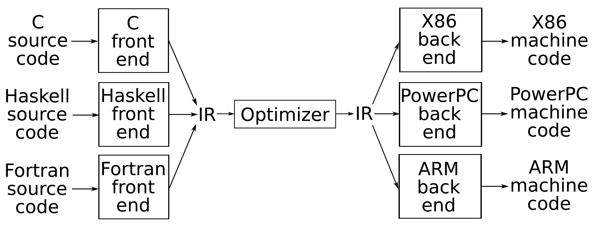
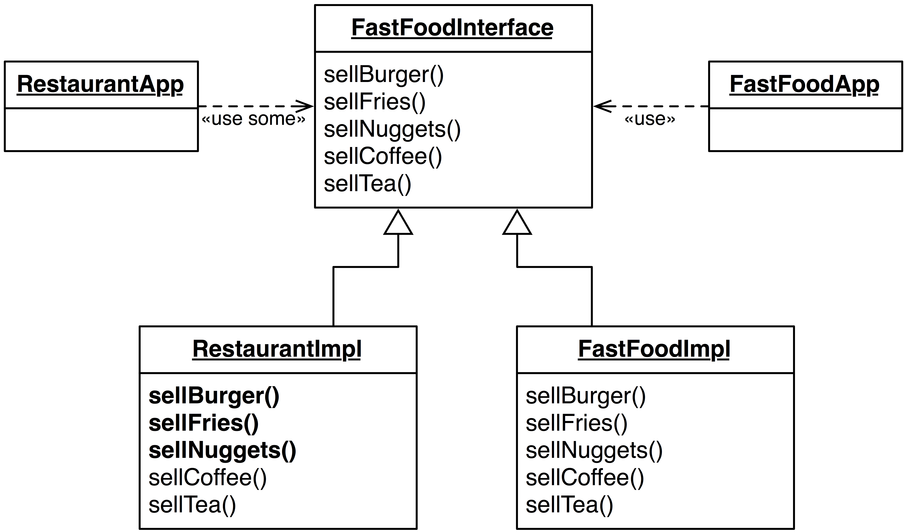
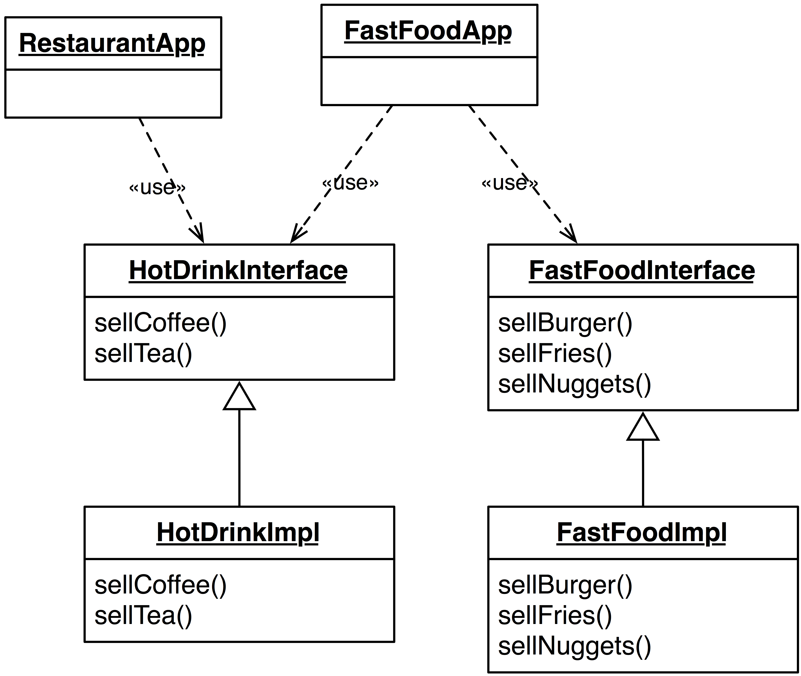
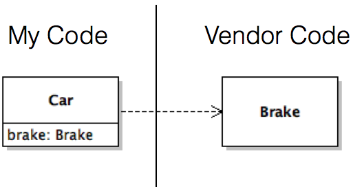
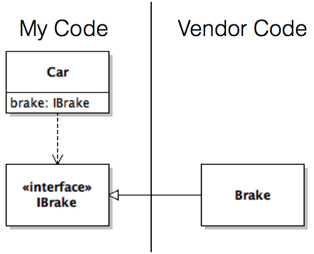
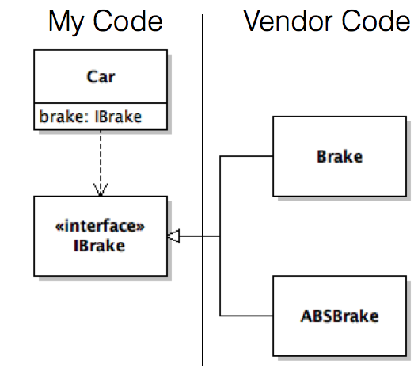

# Design principles

The flexibility of software means any given system can be designed in a variety of ways. Each of these designs will have positive and negative traits, the importance of which will vary between stakeholders. At a high-level we want our software systems to be easy to understand, quick to diagnose and fix, and responsive to future changes. All software _starts_ with this property (the first line of code in a system has all these properties), but as systems grow the initial design is extended, obfuscated, and violated inhibiting future changes. Ultimately, we want to find a set of design principles that act as guidelines to help us avoid poorer designs in favour of those designs that are more amenable to future development.

The following is not a complete list of symptoms of software degradation, they are a set that are worth keeping in mind while reasoning about various design alternatives.

### Rigidity

A rigid design is one that is resistant to change. This is often observed when small changes propagate to unrelated code throughout the system. Rigid software makes planning changes difficult as it can be challenging to develop accurate estimates of how long (and how safe) a given change may be.

### Fragility

Design fragility arises when the design is easy to break. Designs that makes many assumptions about its context or is lax in its pre- and post-condition checking often manifests its problems as fragility. One common example of fragile software is when bug fixes have no logical connection to the code being fixed, this exacerbates problems with fault localization as well as program understanding.

### Immobility

At the line level, most software is not [truly unique](http://web.cs.ucdavis.edu/~su/publications/fse10.pdf). It is frequently the case that developers want to reuse code they have previously developed or have seen elsewhere within their organization (often known as 'clone and own'). Once the developer finds the code they want to reuse they copy it to their system and notice they need another helper file for the code to compile. After copying that file they realize they need four more files. After several hours of copying code they realize the original code was too tangled with its original context to continue (this is also known as pragmatic [software reuse](https://www.cs.ubc.ca/~rtholmes/papers/tosem_2012_holmes.pdf)). 

While this might suggest that refactoring the original code is the best course of action (so it can work in both contexts), in practice this ends up being challenging as the original host of the software only derives risk from this change (because it was working for them already). 

### Viscosity

Software with highly viscous design makes it easier to violate the design than conform to it. Good designs making adhering to the design easier than violating it. Viscous designs also lead developers to break prior design decisions to get their tasks complete; these hacks contribute to future technical debt within the system. 

Viscosity also affects software development tasks. When Builds, tests, commits, and deployments are slow, developers will often 'batch' actions to save time, even if these batches may not be the best or safest way to work.

### Needless complexity

Software is often used to solve complex problems in a complex world. In this way, it is unsurprising the systems we build to solve complex problems ends up being complex itself. At the same time, as developers we like to build systems that could be adapted for future needs. This fitness-for-future is often achieved through abstraction layers built in to the system. Overbuilt abstractions are a source of needless complexity, especially when the abstractions are not actually used to extend the system. While sometimes this is necessary (e.g., if you are building a library) it often results in overbuilt systems that are _harder_ to change, rather than easier.

### Repetition

Software systems are so large that most systems exceed the ability of a single developer to fully understand. If a developer adds a feature or fixes a bug by copying code from elsewhere within a system a _clone_ is created. While this may solve the immediate problem, a future bug or extension to the clone often requires _all_ of the clones to be updated. In large systems it can be hard for these changes to be made consistently across the system. Often near-clones indicate that some simple abstraction is missing from the system.

### Opacity

Systems tend to become harder to understand (more opaque) over time. This often happens as unrelated features are added into convenient, if improbable, locations. This can often be seen when developers are reluctant to create new classes but instead 'glom' functionality into existing abstractions. This can make it hard for the code to communicate its intent.

## SOLID

There are _many_ catalogs of software design principles. The SOLID design principles is one of these that captures five high-level rules for reasoning about the design of an object-oriented software system. These principles are not comprehensive or unique, but can help to address many of the design symptoms listed above.

### Single responsibility

More than any other reason software becomes hard to reason about due to bloat; single responsibility advocates that classes:

> Do **one** thing and do it **well**.

While this sounds simple, in practice it is tempting to add additional similar functionality onto a system that has already been developed because it is 'convenient'. Take for example a simple ```Book``` used within an existing system:

```typescript
class Book {
  getTitle() { .. }
  getAuthor() { .. }
  getContent(..) { .. }
}
```

After several iterations this class could be modified to add e-reader functionality (requiring changing pages and keeping track of page locations) and library functionality (for finding related titles):

```typescript
class Book {
  var currentPage: number;
  getTitle() { .. }
  getAuthor() { .. }
  getContent(..) { .. }
  getCurrentPage() { .. }
  save() { .. }
  getLibraryLocation() { .. }
  turnPage(..) { .. }
}
```

These features _seem_ (and are) related to books, but extend the original intent in ways that make it so any bug fix or feature addition to the system is going to involve ```Book```. It also makes it so reusing an aspect of ```Book``` is going to be challenging. An alternative design to focus on individual tasks could look like the following:

```typescript
class Book {
  getTitle() { .. }
  getAuthor() { .. }
  getContent(..) { .. }
}

class BookReader {
  var currentPage: number;
  setBook(book: Book) { .. }
  turnPage(..) {..}
  goToPage(..) {..}
  getCurrentPage() {..}
}

class BookLocator {
  getLocation(book: Book) { .. }
}

class BookPersistence {
  save(book: Book) { .. }
}
```

While the single responsibility principle will lead to more smaller classes which could seem overwhelming in their aggregate number, these classes are also easier to independently understand, repair, and extend. Several design patterns specifically support this principle including strategy (small algorithms), command (objects do not know about their actions), and state (objects can dynamically reconfigure their actions based on their internal state).

### Open/closed

One of the primary challenges in software design is trying to design a system in a way that supports future changes (without making the current system overly abstract). The open/close principle says that:

> Classes should be open to **extension** and closed to **modification**.

This means that when future extensions are needed to the system they can be easily added _without_ modifying existing system code. Most design patterns have been developed to specifically address the open/close principle by creating simple extension mechanisms that promote obliviousness of the existing code to the new extensions.

For example, the architecture of LLVM has been designed in such a way that the ```Optimizer``` (the most complex part of the system that is also the most frequently improved) can be used by a variety of languages and platforms without knowing what those languages or platforms are. In this way a new language front end or platform backend can be added to the system without impacting the optimizer (and immediately benefiting from all the optimizer provides). 



While promoting extension is relatively easy within a system (by creating useful interfaces and abstract classes), violating open/close is also easy (by having internals check the types being used within a system). ```instanceof``` checks are frequently the source of these violations (when the internals behaves differently depending on the class it encounters).

### Liskov substitution

The Liskov substitution principle says that objects within a program should be interchangeable with any other object with the same parent type. While this sounds abstract, it essentially says that subtypes should all be roughly equivalent to one another. Most design patterns break down if this principle is violated. For example, take the ```Rectangle``` class below:

```typescript
class Rectangle {
  setWidth(w: number) { this.width = w; }
  setHeight(h: number) { this.height = h; }
}
```

A reasonable extension for ```Square``` might be to simply extend ```Rectangle``` and ensure that the width and height of the class are always the same:

```typescript
class Square extends Rectangle {
  setWidth(w: number) { this.width = w; this.height = w; }
  setHeight(h: number) { this.setWidth(h); }
}
```

Unfortunately, this could break existing code that depends on ```Rectangle``` subtypes actually behaving like Rectangles, e.g.,

```typescript
var s: Rectangle = new Rectangle();
checkRectangle(s);
s = new Square();
checkRectangle(s);

checkRectangle(s: Rectangle) {
  s.setHeight(1);
  assert(s.height).to.equal(1);
  s.setWidth(2);
  assert(s.width).to.equal(2);
  assert(s.height).to.equal(1);
}  
```
In this case the final assertion will fail for ```Square``` in a way that passed for ```Rectangle```. This can often be the cause of extremely subtle bugs that hare hard to diagnose.


### Interface segregation

As with classes (single responsibility), it is often tempting to add unrelated methods to interfaces. Interface segregation says that:

> Clients should not be forced to **depend** on interfaces they do **not** use.
 
In this way, we are promoting _thin_ interfaces that contain only the methods required to support the a specific focused set of functionality that will either all be needed (or not needed at all). Specifically, interface segregation aims to dissuade us from having to provide null implementations for a set of methods specified by an interface that we do not actually need (which itself is a violation of the Liskov substitution principle). 

For example, consider the diagram below. In this case ```FastFoodApp``` is being successfully used in an existing fast food restaurant. The developer decides to expand to a non-fast food restaurant. Unfortunately, the fast food methods in ```FastFoodInterface``` are extraneous in this new design resulting in many extraneous empty methods within ```RestaurantImpl```:

 

One alternative design would be to split the interface into logical pieces and allow ```FastFoodApp``` to use both interfaces.




### Dependency inversion

The dependency inversion principle says that classes should:

> Depend on **abstractions**, not **implementations**.

This principle aims to decouple high-level classes from the low-level implementations they use. This is accomplished by introducing high-level interfaces that the high-level classes depend upon while the lower-level classes implement the new interface.

In this concrete example, a ```Car``` depends upon a vendor implementation of ```Brake```:



Unfortunately, this tightly couples ```Car``` and ```Brake``` and makes it hard to reuse ```Car``` without also reusing ```Brake``` (and any dependencies it also has). The author of ```Car``` can instead introduce an ```IBrake``` interface and instead have ```Car``` depend on the ```IBrake``` abstraction. This enables ```Car``` to be reused without the ```Brake``` implementation.

 

This pattern also enables other implementations of ```IBrake``` to be used without penalty. These implementations could be provided by the same vendor as the original ```Brake``` or could originate from a new vendor or be replaced with internal implementations. 



While ```Car``` now relies on ```IBrake``` there is still one place in code where the dependency on the concrete implementation is realized, the constructor call to set the ```brake``` field (e.g., ```this.brake = new ABSBrake();```). Removing this dependency is the primary goal of Factory design patterns and of dependency injection.


### References

* A [nice overview](http://www.codemag.com/article/1001061) of design principles and why they are useful with more concrete examples of the principles.

* [Design principles and patterns](https://web.archive.org/web/20150906155800/http://www.objectmentor.com/resources/articles/Principles_and_Patterns.pdf).

* [Single responsibility](https://web.archive.org/web/20110722075209/http://www.objectmentor.com/resources/articles/srp.pdf) principle.

* [Open/close](https://web.archive.org/web/20110714224155/http://www.objectmentor.com/resources/articles/ocp.pdf) principle.

* [Liskov substitution](https://web.archive.org/web/20110722014513/http://www.objectmentor.com/resources/articles/lsp.pdf) principle.

* [Interface segregation](https://web.archive.org/web/20110721185444/http://www.objectmentor.com/resources/articles/isp.pdf) principle.
 
* [Dependency inversion](https://web.archive.org/web/20110714224327/http://www.objectmentor.com/resources/articles/dip.pdf) principle.
 
---
[](https://creativecommons.org/licenses/by-sa/3.0/) [Reid Holmes](https://www.cs.ubc.ca/~rtholmes/)