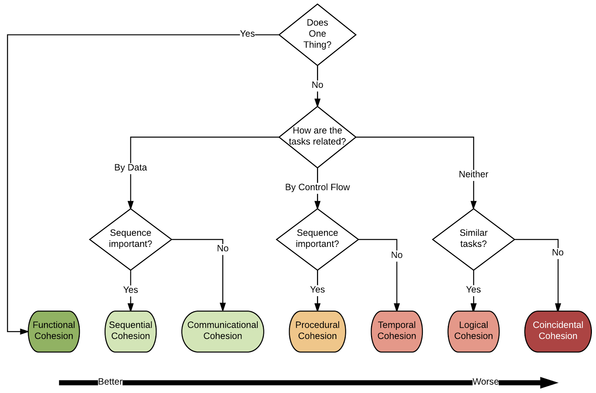

# Design principles

Design principles are high level guidelines that can help ensure our designs are robust in the face of defect fixes and feature additions. There are a great many design principles, here we only address a small subset of these. One thing to keep in mind is that these principles are not absolute: sometimes you will violate them, but if you do it should be careful to do so in a considered manner.N

## Designing for evolution

Designing systems in a flexible manner is crucial, given that all successful systems evolve over time. Making intentional decisions about the coupling within our system cohesion between program elements can help guide us towards ensuring that our designs are amenable to future evolution and defect fixing.

### Coupling

Coupling is a property that indicates the strength of connections between different program elements. Strong coupling is problematic because it negatively influences the evolvability and maintainability of a program. There are several reasons for this:

* Coupled code makes it easier for errors in one part of the system to propagate to other unrelated parts of the system.

* Coupling increases the degree to which a single bug fix or feature addition is scattered across the codebase.

* Code that is tightly coupled is much harder to reuse independently than code which is loosely coupled.

* It is harder to understand a source code element that is coupled to other elements because individual elements cannot be considered (and understood) in isolation.

Two program elements are considered independent if they can function without the presence of the other. It is important to remember that any non-trivial system _requires_ that there be some coupling between elements, the goal is not to eliminate it but to make the coupling be as loose as possible. There are three primary ways to decrease the coupling between program elements:

* **Minimize number of interfaces between elements**: The more interfaces two program elements need to share, the more tightly they are coupled to each other. 

* **Minimize complexity of interfaces**: Since some coupling is often needed, reducing the complexity of this coupling to its core elements can make the interaction between the program elements clearer and easier to reason about and evolve.

* **Avoid control flow coupling**: It can often be convenient to pass objects that control the flow of computation within another element, while this is ok if the element being passed is some type of data structure, it can be more problematic if the control flow is being influenced by simple control flow flags (e.g., some kind of `boolean` flag that takes one program path over another).

The flow chart below can be helpful for reasoning about the coupling between program elements. One thing to note is that not all coupling is equally detrimental: coupling elements by simple data types is less problematic than coupling them through global variables (common coupling) or internal field access (content coupling).

<!-- TODO: describe levels -->

### Cohesion

Cohesion is a property that indicates how focused our program elements are on performing a single complete task. This is easiest thought of in terms of classes in object-oriented design. In this space, cohesion measures how well the elements within a class belong together. Classes with low cohesion are responsible for a wide variety of tasks; these classes are harder to reason about as they often have many competing concerns within their implementation that might conflict. This can cause maintenance problems because changes to fix one defect within a class might actually be by design for another feature provided by the class. The larger a class grows in scope, the more likely this kind of problem is to be be encountered.

Cohesive classes generally have a small set of private fields that make sense to the majority of the public methods within the class; if there are fields within the class that are only used by a small fraction of the public methods it may be a sign that the functionality provided by those methods and the private field may not be cohesive with the overall functionality of the class.

Since cohesive classes are smaller, they lead to a proliferation of classes within a system. While this might make it harder to find the right class within the system, it greatly eases how hard it is to understand that class and simplifies any future bug fixes or feature additions that may be required.

The flow chart below can be used to reason about the kind of cohesion within a design. As with the coupling flow chart above, some kinds of cohesion are better than others. Thinking about the cohesiveness of our program elements can help us to understand when further decomposition of our designs might be helpful and will also motivate the organization of our program elements into their most appropriate subsystems.

<!-- TODO: cognitive dimensions -->

<!-- TODO: describe levels -->

<!-- TODO: include design guidance and symptoms -->
<!-- rigidity, fragility, immobility, viscosity, complexity, repetition, opacity -->

## SOLID

Design principles provide guidelines to help us reason about specific properties within our designs. It might be tempting to treat design guidelines as rules, but that is not their intent: designs will often contravene well-established guidelines; in fact, many guidelines themselves are often in tension with one another forcing engineers to think about their systems to determine which principles are more important to their system. 

There are many catalogues of design principles. While some of these are broadly applicable, others will be unique to specific domains. One of the most commonly-used catalogs are the SOLID design principles.

### Single responsibility

As systems grow it becomes harder to understand them, fix defects within them, and add new features to them. The single responsibility principle says:

> A software module should do one thing and do it well.

One reason this becomes problematic as systems grow is that it often seems easier to add code to an existing module than to create a new module from scratch. This means that code gets added in places where it might not fit well and this mismatch can make the module harder to evolve.

Many design patterns have been explicitly crafted to encourage designs that adhere to the single responsibilty principle. For example:

* Strategy pattern: In this pattern, modules encapsulate algorithms; this means we create modules that _only_ implement a specific algorithm.

* Command pattern: This pattern separates the notion of an action that can be performed from its implementation. This results in small modules that only provide the features needed for a specific action.

* State oattern: Systems often depend differently according to their internal state. Rather than having large modules that need to reason globally about all states, this pattern encapsulates the behaviours for a single state in a single module resulting in smaller, more targetted code.

### Open/closed

The open/closed principle states that modules should be:

> Open to extension but closed to modification.

This principle encourages software engineers to design their code that is more amenable to future change. Specifically, the open/closed principle encourages engineers to think explicitly about what parts of their systems should enable future feature additions and which parts of the system should not. This distinction is important, because extension points typically add abstraction to a system which makes them harder to understand. We might want to explicitly inhibit some kinds of extensions as well due to negative performance or security implications. By explicitly planning for future extension, new features can be added in a way that does not cause existing code to be modified.

This design principle is explicitly supported by most design patterns as these predominantly describe explicit extension points (e.g., by adding new strategies, states, commands, decorators, observers, etc.) that can be extended while existing code remains oblivious to the new features.

One of the biggest challenges with this principle is knowing _when_ to enable extension; this usually takes explicit discussions with system stakeholders to reason about the explicit costs and benefits of such an extension mechanism.

One common code smell for violating the open/closed principle are `instanceof` or `typeof` checks within the code. These checks mean that if a system is extended with a new feature, client code will probably need to be updated as well so that the type checks also check for the new features. This is one of the primary reasons to be wary of this kind of runtime type checking. <!-- private super fields -->

### Liskov substitution

The Liskov substitution principle says:

> Any object can be interchanged with any other object that has the same parent type. 
 
For a complete coverage of this design principle. Since this has been covered in prior courses, we will not discuss it further here, but you are encouraged to watch [this video](https://www.youtube.com/watch?v=j6jbTMpZkWQ) for a more complete description.

### Interface segregation

The interfaces segregation principle says:

> Clients should not be forced to depend on interfaces they do not use.

This principle exists because as we evolve our systems we often do so by adding new methods to our interfaces rather than by creating new ones to succinctly capture the added feature additions. This principle can be thought of as applying the single responsibility principle to interfaces (instead of to classes) as it really pushes us to design our interfaces to be as small and well-focused as possible.

### Dependency inversion

The dependency inversion principle says:

> Classes should depend on abstractions, not implementations.

This principle helps engineers to design implementations that are as decoupled from one another as possible. This usually happens by injecting an interface between the two concrete classes and having the classes take dependencies on the interface instead. While this might seem like a small difference, it means that if you wanted to reuse one of the classes you would also only have to reuse the interface rather than the concrete class and all of its concrete dependencies.

When we refactor an existing system to encourage extensibility, we often do it through dependency inversion. Specifically, we introduce a new interface and make the existing code implement the interface. This makes the post-refactor code both easier to reuse and extend.

### References

* TBD

---
 [Reid Holmes](https://www.cs.ubc.ca/~rtholmes/)
