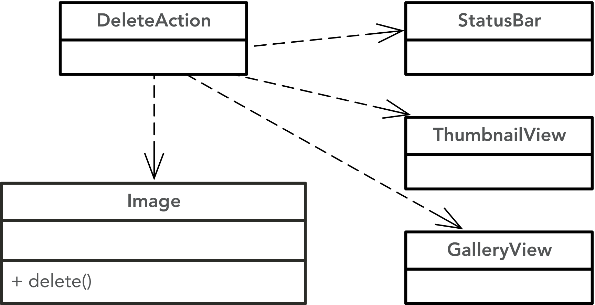

# Low level design

While high level design principles (like an emphasis on low coupling and high cohesion) provide broad guidance while considering design decisions, lower level design is about deriving concrete designs that can be directly implemented in programming languages. To accomplish this, low level design relies on more specific design guidance, although this guidance can be easily associated with the [high level design](readings/DesignPrinciples.md) principles that they codify. Three commonly used low level design principles are:

* _Encapsulate what varies_: A central low level design goal is to identify parts of the system prone to future modification, likely to need future extension, or could be reused in other contexts and encapsulate them to ease these future tasks.
* _Design to interfaces_: Coupling to concrete elements is the primary inhibitor to the above encapsulation; by designing our systems around interfaces, evolving or replacing concrete implementations becomes much more tractable.
* _Favour composition over inheritance_: While it is tempting in object-oriented languages to reuse functionality through inheritance, this means types must extend other concrete classes. While inheritance is a powerful tool and is often the best mechanism for a problem, composition and delegation is frequently a better choice for supporting long-term evolvability.

One of the most commonly used mechanism for creating low level designs are design patterns. While catalogs of software design patterns are relatively young (e.g., the Gang of Four published their [seminal work](XXX) on this subject in 1999), the power of using patterns for understanding diverse sets of data have been widely understood. For example, in Christopher Alexander's et. al.'s seminal book [_A pattern language_](https://en.wikipedia.org/wiki/A_Pattern_Language) on architectural patterns, the authors note that:

> “At this final stage, the patterns are no longer important: the patterns have taught you to be receptive to what is real.”

This is notable because it emphasizes that the important part of the pattern is not the pattern itself, but the commonly occurring problem the pattern solves or the commonly desired benefit the pattern imparts through its use. By focusing on these problems/benefits we are able to understand the key design problem we are trying to solve, rather than being distracted by the mechanism used to solve them.

## Design patterns

TBD

### Observer: Simplifying state update notifications.

When a user makes a change to a program, they expect the change to be consistently reflected across the entire system. For example, if you delete an image file from a photo viewer, one would expect the thumbnail to disappear, the photo to be removed from the gallery view, and the total number of files in the status bar to be updated to reflect the deletion. A poor initial design for this problem can be seen in the figure below. While for this one action this design might not seem like a big deal, for a real application with hundreds of actions and dozens of views, the design could require dozens of classes to be modified each time a new view was added.

Ultimately a designer would like to decouple the state changing actions in the system from how they are reflected by the other components. The observer pattern enables this decoupling by leverages dependency inversion to implement a mechanism commonly known as [inversion of control](https://martinfowler.com/articles/injection.html). While a traditional program calls the components it uses (e.g., your program calls methods in a library), inversion of control provides a means for a library to call _into_ your code. 

For our image deletion example, `Image::delete()` calls `Observable::update()` which iterates through its `observers` list and calls `notify(this)` on all of them so they know that an object they are interested in has changed state. Each `Observer` can then react accordingly. This design means that the `Observable` classes are not coupled to any concrete `Observer` objects, making it so new `Observer` classes can be added to the system at any time. The system is also dynamically efficient because `Observer` objects can be dynamically added (and removed) from observable objects as needed by the system. 

In this system, many different model elements would likely be `Observable`: PDF files might render differently in the gallery view when they are selected (to allow access to different pages of the document) or folders might give some hint about their contents in their thumbnail representation. The value of the observer pattern becomes clearer as the number of observable and observing classes grows.

It is important to note that there is still _some_ coupling in this design: observable objects must know about the `Observer` interface so they knows how to notify their observers, and all observers must know about the objects they are observing. But one crucial aspect of the coupling is removed: the `Observable` objects do not know anything about the concrete subtypes of `Observer`. This means new observers can be dynamically added to an object at runtime (for instance if a new view was opened in a user interface), or the system could be extended by adding a new subtype of `Observer` without changing any of the model elements that the new observer might want to watch for state changes. 

<!-- TODO: push vs pull observation -->

### Facade: Making common tasks easy.

TBD

### Strategy: Encapsulating algorithms.

TBD

### State: Dynamically changing behaviour based on internal state.

TBD

### Decorator: Dynamically adding responsibilities to objects.

TBD

### Visitor: Localizing data structure traversal.

TBD

### References

There are a vast set of resources about design patterns, the following are only a rough starting point:

* [Design Patterns: Elements of Object-Oriented Software](https://www.amazon.ca/Design-Patterns-Elements-Reusable-Object-Oriented/dp/0201633612) (Gang of Four Book).
* [Head First Design Patterns](https://www.amazon.ca/Head-First-Design-Patterns-Brain-Friendly/dp/0596007124/ref=sr_1_1?ie=UTF8&qid=1541463656&sr=8-1&keywords=head-first+design+patterns) 
* Source Making [Design Pattern Reference](https://sourcemaking.com/design_patterns) 
* Gang of Four [Pattern Catalog](http://www.blackwasp.co.uk/gofpatterns.aspx)
 

---
 [Reid Holmes](https://www.cs.ubc.ca/~rtholmes/)
