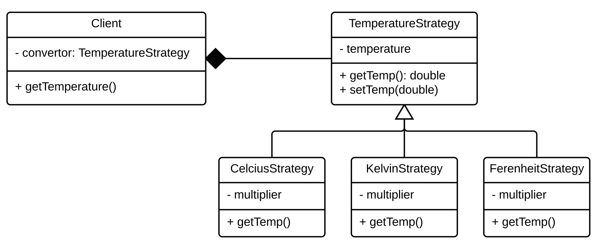
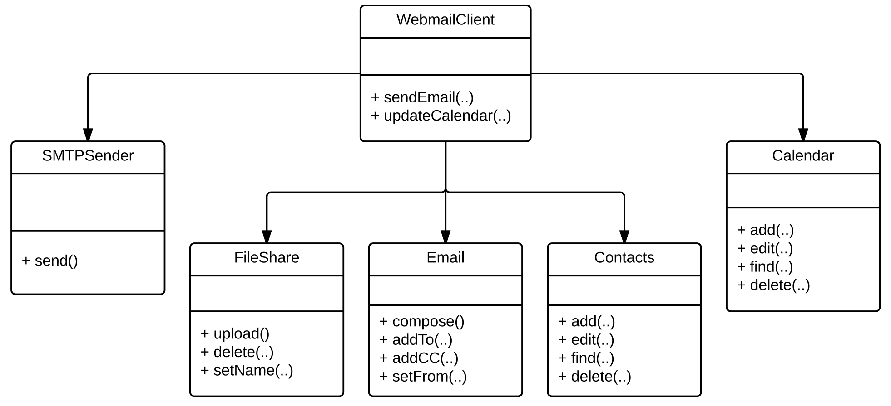
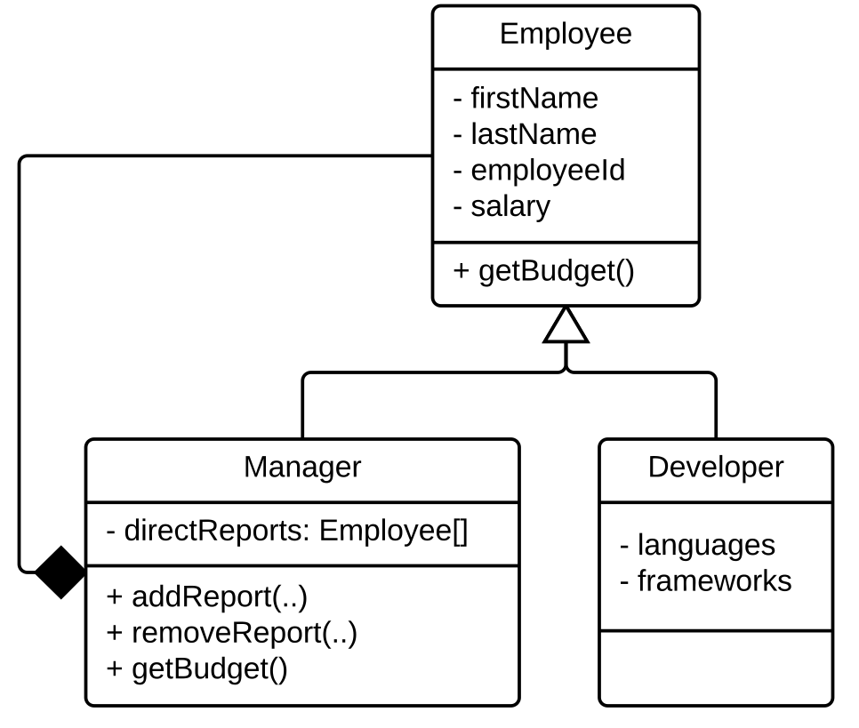

# Design patterns

Design patterns are ways of structuring software to solve specific evolutionary problems. Every design pattern tries to improve upon some aspect of [design principles](Design.md).

Design patterns leverage existing design knowledge to enhance a system's ability to respond to future changes. Although it is easy to think about the pattern itself as the most important part of applying a design pattern, in practice the most important task is actually _thinking_ about what properties of the system are improved by the design pattern; this enables reasoning about both the strengths and weaknesses of the design in the face of some evolutionary task.

While design principles are a nice way to think about the mechanics of what each design pattern entails, sometimes it is more helpful to think about them from a lower level. At their core, all design patterns try to do one or more of the following:

* ***Encapsulate what varies***: By encapsulating what varies, the designer can try to ensure that appropriate abstractions are present in the system to ease future changes. 

* ***Design to interfaces***: Coupling classes through interfaces instead of concrete classes reduces the dependencies between classes, easing reusability and extensibility.

* ***Favour composition over inheritance***: While inheritance is great when only one aspect of the system varies, when changes demand more than one point of variability inheritance starts to suffer (or may not even be possible in languages that only support single inheritance). By leveraging composition, variations can be handled through delegation.

Blindly forcing design patterns into inappropriate contexts is often worse than the code without the pattern applied. This is because most patterns work through additional abstraction layers which can make the system harder to understand and maintain. 

Below we will describe a number of design patterns from a high level. For more details, a vast collection of resources can be found online.

### Observer

The observer design pattern enables one-to-many relationships between objects to be easily captured in code. The pattern also enables these relationships to be dynamically modified. The primary benefit of the pattern is that subjects that are being observed remain oblivious of the objects that are watching their changes. 

This pattern has one major design choice that needs to be made: whether the observers are _pushed_ the specific changes made to the subjects or whether they have to _pull_ them. In the push model, the subject calls ```notify``` with some representation of a change (e.g., in our example the ```notify``` call might be accompanied with the ball's position). This model assumes the Subject can always know the right data to send with the update.

In the pull model, the ```notify``` call is instead accompanied by the Subject itself (e.g., in ```Ball::stateChanged()``` there would be a call ```this.update(this);```). This enables the Observers to query the Subject to understand how it has changed, but requires that the Observers also know about the Subject's interface.

The ```Subject``` class often implements the add/remove/notify methods directly, but could itself extend a more generic base class that provides these features (e.g., the Java ```Observable``` class).

In the example below, the ```Ball``` remains unaware of the number, or composition, of the observers that are watching its updates. Whether one player is playing haki sack or 22 players and 3 refs are involved in a full game, the ball is oblivious. 
The example below uses the pull model: the ```notify``` call includes the ```Subject``` object so changes can be pulled.

<!--
Game analogy
http://www.codeproject.com/Articles/12183/Design-Your-Soccer-Engine-and-Learn-How-To-Apply-D


-->


### Strategy

The Strategy design pattern enables encapsulation of algorithms. This lets client programs depend on the algorithmic interface without having to depend (or know about) the concrete underlying implementation being used. This allows new algorithms to be easily defined and added to a system without changing any client code.

The strategy pattern is often used to avoid subclassing the client. In our example below, you could imagine ```Client``` being extended by ```CelsiusStrategy```, ```KelvinStrategy```, and ```FahrenheitStrategy```. While this would work, it would mean that ```Client``` would have to be changed to add a new form of temperature conversion. The pattern also supplants the even simpler approach whereby the code would have a series of conditional statements to choose the right temperature multiplier (which would also require ```Client``` changes to extend):

```
if (tempScheme === 'C') {
	...
} else if (tempScheme === 'F') { 
	...
} else if (tempScheme === 'K') {
	...
} else {
	...
}
```

In general, strategies are fairly constant at runtime (e.g., the concrete type of the underlying strategy will not frequently (or ever) change once it has been set). One challenge with the strategy pattern is that the client needs to know about the available strategies to be able to instantiate the one they are to use, although factories or dependency injection can play a role here to help insulate the client from this instantiation step. 

<!---
go with temperatures:

http://www.codeproject.com/Articles/13229/Implementing-Observer-Strategy-and-Decorator-Desig


-->




### State

The state design pattern provides a composition-based approach for clients to manage their behaviour dynamically as their internal state changes. The current state of the system is dictated by a reference to a state object; the reference is dynamically updated as conditions change. Rather than having one large ```if``` or ```switch``` statement controlling state transitions, transition decisions are left to the state objects which only need to reason about their valid transitions, not all global transitions. 


<!--
From: https://jklunder.home.xs4all.nl/elisa/part05/Design%20Patterns/State.html

also cool: http://gameprogrammingpatterns.com/state.html


-->

In the diagram below, ```TCPState``` objects use their reference to ```TCPConnection``` to call ```setState(TCPState)``` as the state of the system changes. In this way the client (```TCPConnection```) always knows its current state without being responsible for making sure it is correct. As the client performs actions on its ```state``` object, that object can itself update the client's ```state``` in response to any action. In this way the client delegates the responsibility for managing state transitions to the state hierarchy.

The state pattern isolates state decisions which makes reasoning about how or why these transitions took place much easier (for example because one could add logging to ```setState(..)``` in a way that would be opaque if the state was determined by examining values in fields within the system). This typically simplifies state management as well as from any given state there is a subset of valid other states that the program could transition to; this means the transition code is much simpler than a global block which must consider all possible transitions. 


For example, the client could avoid change-prone brittle control flow like the following (this is a subset of what would be required in the example):

```
if (last == null || last == '') {
  handleClosed();
} else if (last == 'listen' && isOpen()) {
  handleOpen()
} else if (last == 'established' && isClosed()) {
  handleClosed();
} else if (last == 'listen' && isClosed() {
  close();
}
```

Clearly the Sate and Strategy patterns look structurally identical. And, except for the ```setState``` method and the fact that every state object has a reference to its context (so it can call ```setState```) they are identical. The difference lies more in the _intent_ of the pattern. Strategies are fixed at the start of execution, whereas the States change repeatedly and often during runtime. This distinction further reenforces that the most important aspect of patterns is not their structure and form, but what they _do_ and how they promote encapsulation and evolution within the system. 

<!--
TODO: extend with statechart-based example & code from more than one state vs global state.
-->

### Facade

The Facade is a structural pattern to provide a unified set of interfaces for a subsystem. Subsystems can contain a large amount of code that even if well designed can be difficult for a client to learn to correctly use. Facades provide coherent simplifications of modules for performing common tasks. It is not uncommon for a subsystem to have multiple facades for different client use cases. Facades are usually easy to implement once you have a complex subsystem that you want to provide a more unified high-level interface to. 

One important note is that while a facade can simplify a subsystem, it does not prohibit clients from accessing features within the subsystem directly. Facades are mainly a pattern of convenience to make it easier for clients without restricting their options; however, if a client does only use the facade to access the subsystem they are also more insulated from structural changes within the subsystem as only the facade itself should have to be updated to support these, rather than the client themselves. One way to think about facades is that they essentially insert a layer into the design between the client and the subsystem. In architectural terms this is a 'non-strict' layer, since the client can bypass the facade to access the internals.

<!--

-->

Consider the following ```WebmailClient```. This class is tightly bound to all of the subsystem code; if it wants to compose an email with an attachment or an appointment it needs to collaborate with many different classes. The author of ```WebmailClient``` is almost certainly a different developer than the creator of all of those classes so they need to learn a large set of APIs (both which APIs to all, and in what order) to complete their task. Additionally, any changes to those APIs could impact their code; since there are so many direct dependencies the chances of a change impacting their system is not small.



To ameliorate this, they talk to the developers responsible for the PIM code and ask them to create a Facade that is easier for them to use for these common tasks. The PIM owner creates ```PIMFacade``` that hides the internal details of the PIM subsystem and allows ```WebmailClient``` to have only a single dependency. This decreases coupling between the client and the PIM classes, and adds a layer of abstraction so the PIM subsystem owner can simply update the ```PIMFacade``` if any of their internal classes change in a way that could propagate to the client. This both simplifies modification tasks for the owner of ```WebmailClient``` as they are insulated from these changes, but also for the owner of ```PIMFacade``` because they know they can make larger changes as long as they do not need to change the facade API.


### Decorator

The Decorator pattern is another structural pattern that provides a means to dynamically augment an object's responsibilities. With the decorator pattern it is important to distinguish between an _object_ and a _class_. A class is the structural template from which object instances are created. That is, an object is a single instance of a class and a class can have many different instances. Each object can have different field values, but the fields, methods, and parent types they have are all defined by the class they are instantiated from.

The decorator pattern exists to add new responsibilities to _objects_, instead of to their whole _class_. This means that two objects instantiated from the same type can be modified at runtime to behave differently. Decorators work by enabling objects to be wrapped in other objects and using composition to treat the wrapped object as if it were a single object.

<!--

-->

For example, consider the following simple system where we can have a ```Car``` or three special versions of with additional features:


One day a new customer asks for a car with both nav and adaptive cruise control. Planning ahead, the team realizes it is only a matter of time before customers ask for any subset of these features and set out to extend their design in the way that best preserves their existing design:


While the above approach is conceptually consistent with the initial design, having seven subclasses of ```Car``` is not optimal and will surely cause extreme resistance to any new feature being added (for example ```CarAutoLights```) as this will have to be mixed in with every existing subclass. Instead, the team decides to move to a system using a decorator, which enables a ```Car``` to be 'wrapped' in instances of ```CarDecorator``` to add additional features; this is great, because adding a new features means just adding a single extra class meaning the development team can go home for Christmas after all:


It can be hard to visualize what this means from the class diagram alone. To create a version of a car with Nav and AutoBrake, one only needs to do the following:

```
	var car = new Nav(new AutoBrake(new BaseCar())));
```

Even at runtime this could allow for additional features. For instance:

```
	// create car with Nav off
	var car = new AutoBrake(new BaseCar()));

	// ... sometime later:
	
	// turn on Nav, wrap existing object
	car = new Nav(car);
```

<!--
  TODO: this really needs some methods to work. Unfortunately, this isn't a great example because common methods between Nav and AutoBrake beyond 'on', 'off', and 'diagnostic' are limited.
-->

The decorator does have some downsides: it is impossible to control the 'order' of the wrappers with the pattern. This also means that the wrappers cannot interact with one another directly (e.g., above we could wrap a ```BaseCar``` with ```Nav``` twice, which doesn't make any sense). Also, decorator objects tend to be fairly small resulting in a large number of classes. Decorators also interfere with object identity, so code that relies on checking identity (e.g., with ```instanceof```) will behave differently with wrapped and unwrapped objects.

Ultimately the decorator pattern provides excellent support for maintaining the flexibility and extensibility of the system. Base classes can be kept simple focusing on their core responsibilities (single responsibility), while additional functionality can be implemented in decorators (open/close). This also means adding new decorators is easy and does not change the base classes. This is a textbook demonstration of the flexibility of composition over inheritance. 

### Composite

Composites provide a mechanism for treating groups of objects the same as individual objects (often known as part-whole hierarchies). Systems often start with individual objects, but over time gain the ability to group objects together. Adding logic to differentiate individual objects from group objects adds unnecessary complexity to code. The composite pattern, through the composite (```Manager``` in the example below) uses composition to maintain a list of children while still itself being the parent component type (```Employee``` below). 

The introduction of the composite  means any client can treat both managers and developers as employees (e.g., by asking for their names or ids uniformly), whether they have reports or not. This frees client code from checking if the ```Employee``` reference they have is a ```Manager``` or a ```Developer```, and enabling a ```Manager``` to appropriately traverse all of their reports appropriately (even if some of their reports are themselves a ```Manager```).



In the example below, the default implementation of ```Employee::getBudget()``` would just be:

```
	public getBudget():number {
		return this.salary;
	}
```

But the implementation of ```Manager::getBudget()``` would be:

```
	public getBudget():number {
		var budget = this.salary;
		for (let report of this.directReports) {
			budget += report.getBudget();
		}
		return budget;
	}
```

But to the client whether an employee is a ```Manager``` or ```Developer``` would be totally transparent.

```
	// employee 1233 has no reports
	var e1 = getEmployee(1233);
	Log.info(e1.getBudget());
	
	// employee 1234 has 4 direct and 35 indirect reports
	var e2 = getEmployee(1234);
	Log.info(e2.getBudget());
```

<!--

-->


### Visitor

The visitor pattern enables operations to be performed on an object hierarchy without directly modifying the hierarchy itself (either by adding new classes or methods). The primary motivation for the pattern is that given a large set of objects it is often necessary to perform tasks on them that is not a part of their core responsibilities; this pollutes their classes and adds non-essential code to their classes that is spread across all classes. By providing an external mechanism for performing these tasks, the visitor extracts the code from the class hierarchy itself, while also bringing together all of the code for that task that would otherwise be spread across the object structure.

The visitor does require one new method be added to every class in the structure being traversed, which is a method called ```accept(visitor: Visitor): void```. While this is a change to the objects, all future visitors will work with this interface, enabling additional visitors to be added transparently to the system. The pattern acknowledges that the tasks we want to perform _on_ a set of objects vary much more often than the core responsibilities of the objects themselves, so paying this one-time cost to enable future extensibility is often worthwhile.


For instance, in the diagram below one could imagine adding ```numReports``` or ```topLangs``` methods to ```Manager``` and ```Developer```, but instead we have created a ```TopLangsVisitor``` and ```NumReportsVisitor``` which both traverse the hierarchy directly. Each ```accept(v: Visitor)``` method immediately calls ```v.visit(this)``` which uses dynamic dispatch to call the right visitor method. The method within the visitor can then interrogate the provided object to retrieve the required information and maintain a running tally of the answer that can be reported after the traversal is complete (the visitor can accumulate state in its own fields). Note, ```Manager::accept(Visitor)```  would be slightly different (e.g., each object will ensure that its correct children (or composite components) are visited appropriately):

```
	public accept(v: Visitor): void {
		for (var r of this.directReports) {
			r.accept(v);
		}
		v.visit(this);
	}
```

While adding new visitors is easy, adding new concrete types to the type hierarchy is hard. This is because every visitor needs a ```visit``` method for every type that is being traversed which could result in many visitors being impacted. Also, due to the runtime operation of the visitor being dictated by dynamic dispatch, it is often challenging to understand how the visitor works, if a problem is ever encountered.

<!--

-->


<!--
Dropped due to lack of time:

### Command


### Builder


-->


### References

* Great overview of [most](https://sourcemaking.com/design_patterns) design patterns with concrete examples.

* Repository of [many design patterns](https://github.com/torokmark/design_patterns_in_typescript) implemented in TypeScript.

---
![] (figures/CCSA.png "Creative Commons: Attribution-ShareAlike") [Reid Holmes](https://www.cs.ubc.ca/~rtholmes/)
