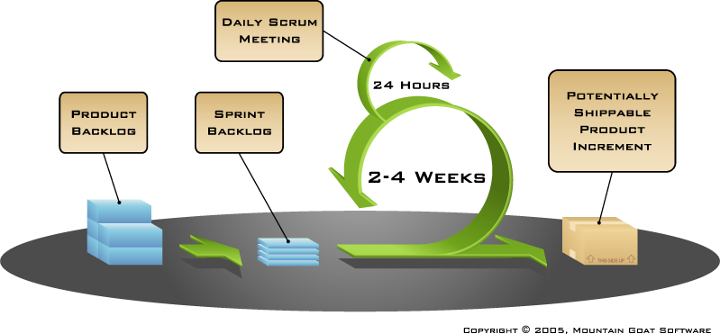

# Software processes

Software processes enable us to structure the diverse set of activities needed to create and maintain a successful software project. The goal of all software processes is the same: to define the who, what, when, and how for enabling a project to succeed.

These processes are really about enabling various stakeholders to communicate, discuss, and improve the overall system. Software systems involve a diverse set of stakeholders, including (but not limited to):

* Developers
* QA
* Managers
* Customers
* Users
* Dev/Ops
* Support
* VPs/C-Suite

Since these different stakeholders have different backgrounds, goals, constraints, and knowledge, a variety of different representations and documents are created to help them most effectively communicate. At a high level, each of these representations helps with one of four broad categories: specification, development, validation, and deployment/evolution. These include (again, not exhaustively):

* Mission statements
* Business objectives
* Requirements
* System architecture
* Detailed design
* Implementation plan
* Test plan
* Risk assessments
* Deployment/Ops plan
* Maintenance strategy

Not every project needs all of these documents. For example, a tiny system would have almost identical architectural and design documents. For isolated systems the test plan could include and subsume a formal risk assessment. But once diverse stakeholders are involved they can be extremely helpful. For example, having an architectural plan will make it much easier to develop and refine a deployment plan and provide a mechanism for system architects and the ops team to agree about large-scale layout of the system. Similarly, requirements documents are the fundamental bridge between the technical team and customers while also providing affordances for sales teams (e.g., to know what the product does), support (e.g., to know if the product is supposed to do), and testers (e.g., to develop a test plan for validating that the requirements are met).

The core role of software process is to increase transparency about the software development process so all stakeholders know what is required of them and what they can expect from others. In this way, processes can help ameliorate risk by explicitly capturing stakeholder expectations and constraints.

### Traditional approaches

<!---
TODO: waterfall figure
--->

Waterfall is the 'classic' software development model. This model was adapted from previously-successful engineering processes. In waterfall, each project phase flows into the next with explicit stakeholder sign-off before the next phase begins.

Because the phases are distinct and linear, there are extremely clear hand-offs between the stakeholders involved in each adjacent step. Before a phase can be considered complete, an explicit set of exit criteria must be validated. The primary shortcoming of waterfall-based processes is that there is extreme pushback against revisiting a prior phase: once requirements are complete the requirements are fixed. In practice though, this is extremely limiting as requirements are often imperfectly understood at the outset of a project. Waterfall methods are also not flexible in the face of organizational change. Finally, the overall value of the system cannot be validated until the process has run to completion; this can be problematic for long-running projects.

<!---
TODO: spiral figure
--->

The Spiral model emerged in the 1980s to try to increase the responsiveness of waterfall-based processes. In contrast to Waterfall, the Spiral model revisits each system phase on each iteration. This process can be split into four main phases:

* **Planning**: Gathering and analyzing requirements.
* **Risk analysis**: Identify sources of risk and mitigation strategies.
* **Engineering**: The system is built and validated.
* **Evaluation**: System is validated externally with customers to inform future iterations.

Compared to Waterfall, the spiral model enables much greater sensitivity to changes to requirements than waterfall. Also, by keeping customers involved, the Spiral model can avoid situations where teams end up building the wrong piece of software. Unfortunately, the overhead of performing effective risk analysis and review can be overwhelming, and the duration between spirals (often over one year) result in large delays between customer feedback.

### Agile approaches

<!--- 
TODO: build/learn/adapt figure
--->

Agile approaches formally emerged in the early 2000s in response to concerns that development teams were not able to rapidly and flexibly produce software systems. One of the defining documents of this time was the [agile manifesto](http://agilemanifesto.org/) which can be summed up in four main tenets:

* Individuals and interactions over processes and tools.
* Working software over comprehensive documentation.
* Customer collaboration over contract negotiation.
* Responding to change over following a plan.

These principles are designed to foster increased customer interaction (and accountability) within a software system. The goal is to increase velocity by decreasing the amount of time developers spend building 'the wrong thing' and letting engineering teams try out different design alternatives to find what works best for the customer. The focus on experimentation also means the system is always in a buildable state meaning that agile approaches are often used by teams who need to frequently deploy their systems (e.g., using continuous deployment techniques).

A wide variety of agile methodologies are practiced in industrial settings; these tend to follow a set of principles that work for the team using them, rather than blindly following a prescriptive set of rigid rules. We will briefly touch on three of these methodologies.

#### XP

Extreme Programming (XP) was one of the first widely influential agile methodologies. XP mandated that systems should always be buildable and that developers should be willing to start small and adapt and refactor their systems as the need arose, rather than investing in huge up-front engineering efforts. Teams using XP follow five key principles:

* **Communication**: Enabling open and continual communication between all stakeholders can help projects stay on track and make sure that all stakeholders are aware of the schedule impact various alternative decisions could have.
* **Simplicity**: By focusing on the simplest possible solution, engineers are able to validate their work with customers before tackling more expensive or challenging solutions.
* **Feedback**: Software is not developed in a vacuum, by combining feedback from tests, customers, and the team, more knowledge can be applied to ensure the most locally 'correct' decisions are being made.
* **Courage**: Be willing to discard failed experiments. An experiment is not a sunk-cost, but rather an opportunity to learn and improve the overall system.
* **Respect**: The focus on a system always being executable means that committing changes that 'break the build' is unacceptable as it slows down your teammates and hurts velocity. Respect also means focusing on the long-term understandability of your code by respecting the time a future developer would have to invest in understanding how your code works. 

#### TDD

Test-driven development (TDD) emerged from the agile movement as an approach to ensure that automated testing was always a key part of the development process. This focus on automated testing was important because agile approaches rely heavily on being able to quickly refactor a piece of code and refactoring is often risky if the end-state of a refactoring cannot be easily validated relative to the input state. 

TDD follows a simple linear set of steps:

1. **Add a test:** the first step in TDD is always to write tests. By thinking about testing from the outset, developers are more likely to build [controllable and observable](Testing.md#testability) code. This also helps to shift emphasis from implementing the body of functions to their API signatures.
1. **Run the tests to ensure they fail:** While this step might seem silly, it is important to know, before you refactor, that the only failures in a test suite are the ones you expect (e.g., from the tests you just created for code that does not yet exist). 
1. **Write the code/run the tests:** Next the code is written so that the tests can be made to pass. The emphasis in this phase is on the tests passing correctly, extraneous functionality is explicitly avoided (with the intuition being that if it was not extraneous, there would be a test for it).
1. **Refactor the code:** Since the developer now has a set of passing tests, they can refactor as needed to make improvements to the existing implementation that may be required from the knowledge gained while writing the code in the previous step.

TDD is not often used in practice in its explicit form as developers have a hard tim writing all their tests before starting development. That said, many experienced developers *do* write test skeletons before they start writing the implementations of their features as this can be a helpful way to ensure that the code provides the APIs needed to effectively validate the system. In addition to validation, this also ensures that *clients* will have access to the necessary API to use the new feature effectively.

#### Scrum

Scrum-derived methodologies comprise the most commonly-used agile processes applied in industry today. Scrum is an incremental iteration-based methodology that breaks work into fixed-length *sprints* (these range from one to three weeks). At the end of each sprint the code should be shippable, that is it is properly tested, but likely not complete. A product has a global set of requirements left to be implemented known as the *product backlog*. The work items being worked on in each sprint are called the *sprint backlog*. Scrum does not prescribe any specific engineering practices and instead defer to the team to choose those practices that best meet their specific needs. 
Scrum-based team members also have several process-specific roles:

* **Product owner**: This person defines product features and helps to prioritize features according to their value to the team. After each iteration the importance of various features can be re-evaluated. Establishing meaningful prioritization is an important role for the product owner to ensue that the team focuses their efforts on the most important tasks; this is particularly important during sprint planning.
* **Scrum master**: This is a single person that facilitates the scrum process; often these people have attended workshops to learn techniques for keeping teams on track. The scrum master often works to shield the team from external interference and helps resolve problems that may be blocking the product. The Scrum master is *not* the manager of the team.
* **Team**: Scrum-based teams are typically diverse and cross-functional containing designers, managers, engineers, clients, and test specialists. Teams are usually between 5 and 9 people.

Scrum employs three broad ceremonies:

* **Sprint planning**: This meeting takes place before the sprint and is an opportunity for the product owner to 
describe and motivate the highest priority features from the product backlog for the upcoming sprint (that will then comprise the sprint backlog). During this meeting the team takes the opportunity to probe for additional information so they can be sure they adequately understand the work that will be required. Once the product owner has specified their priorities, it is up to the technical team to build an estimate of how long each task will take, usually represented in 'points' although these are often analogous to hours of development time. The team then makes an explicit decision about which tasks will be a part of the sprint and which will be pushed to some future sprint.
* **Standup meeting**: During the sprint, teams meet daily for a *daily scrum* or *standup* meeting. These are held at the same time and place each day, usually in the morning, and are time-limited (usually 15 minutes or less). Only those team members that are committed, or are involved in the technical challenges of the system, get to speak during the scrum meeting, although others may attend. During this meeting each team member quickly outlines the challenges they are facing and anything that is blocking their progress for that day (some teams use a short script like 'What did you complete yesterday? What will you work on today? What is blocking your progress?', but this is not strictly required. These meetings are a great way for teammates who are working on technically interacting pieces of software to remain aware of what everyone on the team is working on and to help align work for the upcoming day to minimize teammates being blocked by each other.
* **Sprint review**: After each sprint, a review meeting is held for the team to demonstrate their features to the product owner or other stakeholders. This is possible because the output of each sprint is supposed to be a potentially-shippable product. These meetings are light-weight and are usually time limited to under two hours. The team also takes this opportunity to evaluate how much progress has been made on the sprint backlog.
* **Retrospective**: Every product and team is unique, so it is important that the team take time to reflect on how the sprint worked out. Usually this comes in the form of identifying activities the team should start doing, stop doing, or continue doing. This retrospective is a good opportunity to make sure the process is providing value for the team and to find opportunities to improve and refine the activities the team is performing.

<!--- High level scrum discussion & Definition of done -->

### References

* [Why](http://spectrum.ieee.org/computing/software/why-software-fails) software fails article.

* [Jim Cordy's](http://research.cs.queensu.ca/home/cordy/cisc327/327%20Lecture%202%20Fall%202016.pdf) slides on software processes.

---
 [Reid Holmes](https://www.cs.ubc.ca/~rtholmes/)