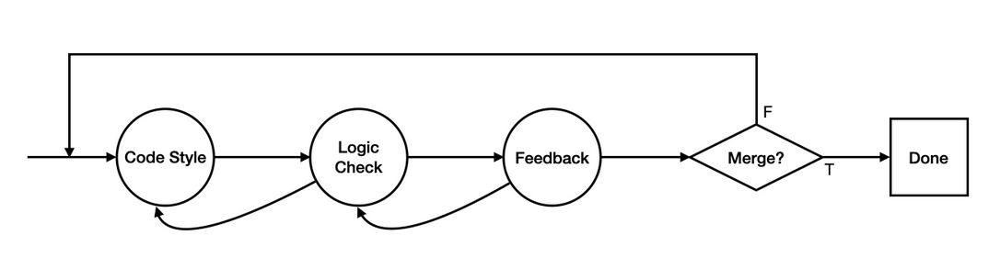

# How to Review Code

Code review will be a task that most developers spend a non-trivial amount of time on during a given workday. Many companies may have strict guidelines on the quality of code that gets merged. Code reviews act as a mechanism to ensure that quality standards are met, and knowledge about a change or a new feature is shared amongst developers. In this document, we’ll detail one methodology for reviewing code.

## Methodology

Code review can be characterized as an iterative process of three steps. These three steps should ideally be independent from each other, i.e. address distinct ideas/parts of the code under review (CUR), and each step should be a top-down pass of the entire CUR. A detailed explanation of each step (or pass) is described below

### *Pass 1: Code Style*

In this pass, you should attempt to identify errors related to code style. This means that you don’t need to really try to understand any new logic that has been introduced (that should be covered in another pass). This pass should be a cursory overview of concerns such as:
* **naming**
  * no single character variable names (unless they’re for loop variables)
  * does a name make sense?
  * is a name consistent with other names in the system?
* **method length/complexity**
  * is a method too long? can we break a method into smaller components?

Note that this pass doesn’t require you to completely understand the logic behind a change or a feature. These concerns are things that a developer could easily identify because they're orthogonal to logical changes.

### *Pass 2: Logic Check*

This is the pass where you’ll attempt to understand the change or feature that has been added to the system. Stylistic concerns should have been addressed in the previous step, so you’ll focus more on why of a change or a feature. This pass should be an overview of concerns such as:

* **code additions (new methods, classes, etc…)**
  * is this addition necessary? Is there a way we can re-use pre-existing logic?
* **code modifications (changing a method, a class, etc…)**
  * does this change affect other parts of the system?
* **code deletions**
  * are there dead references in the system to the deleted code?
* **tests**
  * are there tests for the feature/change? Are any tests no longer valid in the system?

### *Pass 3: Feedback*

In this pass, you should make any comments that pertain to the changes as a whole. It’s usually easier to do this step last since you’ve reviewed the code both stylistically and in terms of what exactly it does. This pass is also the most personal, since you’re likely viewing the changes from the lens of your own experiences as a developer. Comments you may see in this pass are:
* “We might want to extract the logic you’ve added into a supertype, we’re probably going to add more classes that use it later.”
* “I think this might break SOLID, this class is doing way too much and I think we should refactor it.”

## Other resources

* [Google eng-practices: How to do a code review](https://google.github.io/eng-practices/review/reviewer/) 
