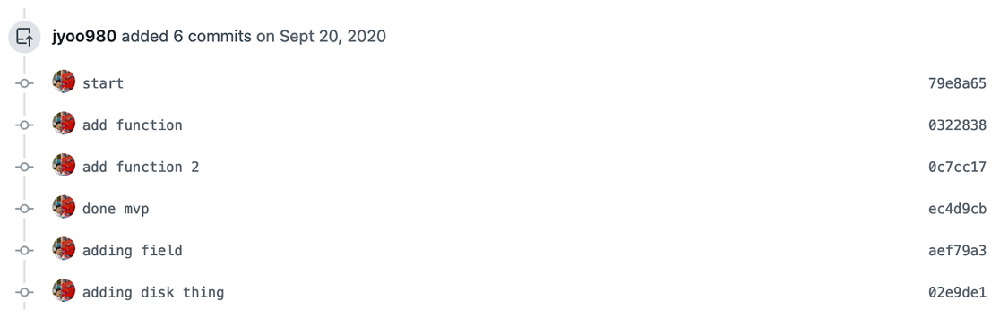
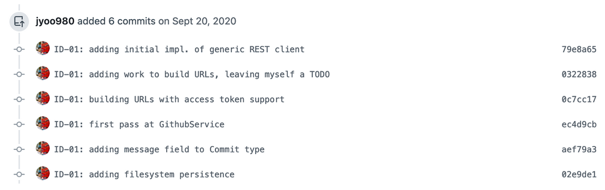

# Writing Useful Commit Messages

You’ve probably seen something like this below. Honestly, you’ve probably done something like this below, everyone has

When you’re committing and pushing code to GitHub, writing a meaningful commit message is probably the last thing on your mind. That being said, writing meaningful commit messages is a skill that’s incredibly valued in industry. This is especially important moving forward since you’ll be working with a partner for your project, i.e. it won’t be enough for just you to know what you’ve modified or introduced.

Commit messages provide a way for other developers to obtain a very high-level overview of the changes you’ve introduced, without even needing to open up a code editor. This is why it’s incredibly important to be as detailed as possible in your commit messages. You can see the difference in the richness of information conveyed in the alternate version of the commit messages below:

In this document, we’ll give a very brief overview of some rules-of-thumb to take into consideration when you’re writing commit messages.

## *Be Explicit*

Although it might be tempting to just write “done” or “completed function”, those messages convey little to no information to the reader. Things to consider are:
* **indicate what you’ve completed**
  * “extracted helper methods from class A to supertype B”
  * “refactored InsightFacade.addDataset to use helper methods”

It will be much easier to find a specific point in the history of your repository when you write very explicit commit messages. Helpful for when your Autobot score suddenly goes down after 10 commits.

## *Set Major Markers*

It’s easy to see that some commits might be more important than others. For example, in one commit you might be refactoring, and in another you may have completed the implementation of a method. You should definitely take advantage of writing commit messages that communicate this information. Some examples can be found below:
* “completed MVP for InsightFacade.removeDataset”
* “finished implementing InsightFacade.listDataset”
* “completed designing a helper class to save files to disk (DiskSaver.ts)”

## *Make References*

You should make use of ample references in your code. Unfortunately, I do not mean pop culture references or memes. If you and your partner are using GitHub issues to track the work to be done in your project, each issue should be created with a given number, e.g. #1, #13, etc… You can take advantage of this and link each commit you make with the issue number:
* “adding id validation to addDataset: #3”

The commit will then be linked to the GitHub issue itself, and this comes with a slew of automations. For example, if a pull request containing a commit with the linked commit message above is closed, it will automatically close the linked issue on GitHub.
