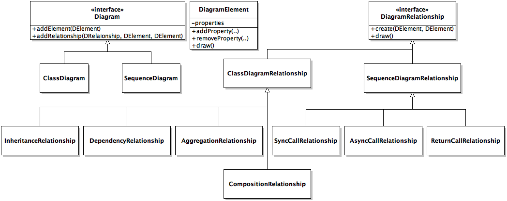

# Technical representations

Many software systems 'fail' because the wrong product is created. One of the primary reasons for this is because of a lack of precision within the requirements. This arises because requirements are often specified entirely using natural language. Expressing requirements using other mechanisms is one common mechanism for reducing ambiguity during requirements elicitation and early design activities; these representations can ensure all stakeholders have a consistent view of how the system will end up being built. These representations can also be used for understanding existing systems during maintenance activities. 

These diagrams provide a means for communicating using [abstractions](Abstraction.md); representations provide concrete details about some aspects of a system while eliding other parts. This decreases the opacity of decision making and enables more concrete discussion. Because of this, it is important that these representations are not ambiguous (open to more than one interpretation), are accurate (correct within some given tolerance), and are precise (so the correct system can be built repeatably from the same abstraction).

Each representation (diagram) can be considered a _view_ of the system. Views often have specific goals, focusing on subsets of elements or relationships. The views also typically concentrate on specific concerns, scenarios, or stakeholders. This means that choosing the right kind of diagram is important to ensure stakeholders can effectively communicate about the attributes that are most relevant to them. Since views focus on subsets of a system, it is important to keep in mind that they typically overlap. Maintaining consistency between different views is important, but can also serve to identify potential problems that may arise when the system is actually built.

The Unified Modelling Language ([UML](http://www.uml.org/)) was developed to provide a standard set of representations for software systems. While UML supports a [wide variety](https://en.wikipedia.org/wiki/Unified_Modeling_Language#/media/File:UML_diagrams_overview.svg) of diagrams they can be broadly decomposed into structural and behavioural diagrams. Structural diagrams capture the key elements and their relationships within the system while behavioural diagrams model how the system components interact with each other dynamically at runtime. These two kinds of views are important because while systems are developed statically, their runtime behaviour is often considerably different and being able to reason about both modes is crucial to avoiding unexpected problems during development.


Unfortunately, given the ambitious goals UML tries to achieve, it has become an extremely complex standard that is rarely used in its complete form in practice. At the same time, technical stakeholders often create visualizations of their intended systems, so being able to interpret, understand, and generate some key diagrams is often helpful in practice. In this reading we will provide an overview of a small subset of UML that is often practically useful without being overwhelming.

### Class diagrams

Class diagrams are the most common form of technical abstraction for software systems. Class diagrams are static representations of the software elements and their relationships within a system. For object-oriented systems class diagrams detail the key classes,  fields, and methods within a system and how they relate to each other statically. While class diagrams can contain all program elements, they typically focus on a key subset of elements (especially with respect to fields and methods); this does not mean that only public API should be shown, but also API that are intentionally not private. These diagrams are an excellent abstraction for developers to reason about and discuss various design alternatives. Class diagrams can be translated fairly directly into code skeletons (and vice versa).

Classes and interfaces are represented by simple rectangles that detail their names, fields, and methods. Method and field visibility can be clarified by prepending names with + (public), # (protected), and - (private). Three primary classes of edges exist in class diagrams. Large hollow arrows represent inheritance relationships. Dotted lines with simple arrowheads represent dependencies (typically through method calls and field references). Solid lines with filled diamonds represent composition relationships; these relationships indicate that the class on the diamond-end creates and is primarily responsible for the lifecycle of one ore more variables of the linked type.

<!-- 
For example, the class diagram below could be used to generate the text that follows.


-->

```typescript
interface IInsightFacade {
	addDataset(id: string, content: string);
	removeDataset(id: string);
	performQuery(query: QueryRequest);
}

class InsightFacade implements IInsightFacade {
	// impl here
}
	
class QueryController {
	performQuery(datasets: Dataset[], query: QueryRequest) { }
}

class DatasetController {
	addDataset(id: string, content: string) { }
	removeDataset(id: string) { }
	getDatasets() { }
}

class Log {
	trace(msg: string) { }
	info(msg: string) { }
	warn(msg: string) { }
	error(msg: string, stack?:Stack) { }

}

class InsightFacadeSpec {
	it(‘…’) { }
}

class QueryControllerSpec {
	it(‘…’) { }
}
```

Translating from class diagrams to/from code is fairly straightforward. A more common use case is to need to translate from a textual description to a potential class diagram. For example the class diagram and high-level descriptions below are different representations of the same task.

<!--
> Design a system for drawing UML class and sequence diagrams. Class diagrams should support inheritance, composition, aggregation, and dependency relationships. Sequence diagrams only support sync & async calls and responses. 


-->

### Deployment diagrams

Deployment diagrams overlay static class diagrams onto the execution containers and physical machines upon which they will reside. Identifying how and where a program will run is particularly important for mobile, distributed, and cloud-based applications. Key stakeholders typically include developers, operations, dev/ops, QA, and infrastructure teams.

Simple deployment diagrams might only concentrate on mapping modules (or classes) onto machines, but in more sophisticated environments could include mapping the software into specific execution containers (e.g., virtual machines, container images, etc.).


### Sequence diagrams

Class diagrams often hide key details that are crucial to understand before key aspects of a system can be developed. Sequence diagrams focus on how code elements communicate with each other capturing the order of execution of particular methods and the data being passed between them. These are typically used by developers but are often also used to capture complex interactions which may also involve dev/ops, security, or usability stakeholders as well. Sequence diagrams specifically aim to model protocols and dataflow through the system. Given the complexity of these diagrams they are usually only generated for a limited subset of important, constrained, tasks.

<!--

For example:

> Develop a Client that needs to respond to a getTeams(..) request, passing the request to TeamController who services the request with a Promise that calls an external Server. Assume this is the first request after the client was started.


-->

### State machine diagrams

State machines are another representation for capturing dynamic interactions. They are extremely helpful for modelling event-based systems, which accounts for most user interfaces. One of the hidden powers of state machines is they enable state complexity to be actively reasoned about and reduced by explicitly considering the 'key' interactions rather than trying to support all possible interactions. 

One use of state machines can be to identify all possible actions and to name them effectively:


A more common example is to detail how the state machine is entered/exited and to show both the possible transitions and capture cases where transitions are explicitly forbidden (eg., within settled states):


### References

* [JetUML](http://cs.mcgill.ca/~martin/jetuml/) is an extremely lightweight diagramming package.

* [ArgoUML](http://argouml.tigris.org/) is one of the most comprehensive UML diagramming solutions available.

* [Example](http://www.uml-diagrams.org/examples/bank-account-domain-diagram-example.html?context=cls-examples) of a simple bank account modelling task. In this case the class diagram helps elucidate the complexity of the task (e.g., the dual nature of Children/Health savings accounts).

* [Example](http://www.uml-diagrams.org/bank-atm-uml-state-machine-diagram-example.html?context=stm-examples) of a state machine that can be used to decrease operational complexity (e.g., by clarifying paths to ```Idle```).


---
[](https://creativecommons.org/licenses/by-sa/3.0/) [Reid Holmes](https://www.cs.ubc.ca/~rtholmes/)
