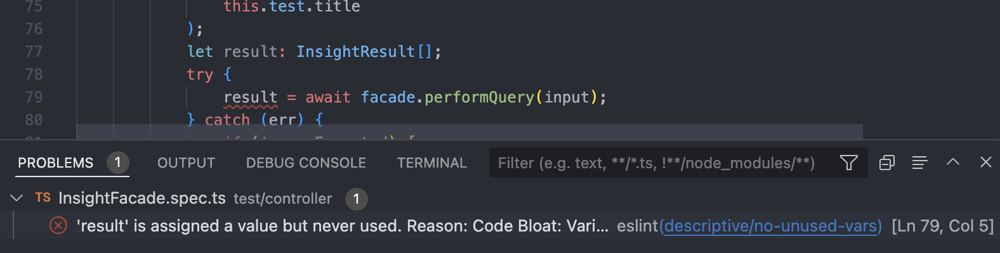

# Setting up your IDE

Configuring your IDE so that it works with static analysis tools will ensure that your development process is smooth (and saves you time!). For CPSC 310, we use two static analysis tools: [Prettier](https://prettier.io/docs/en/index.html), a code formatter, and [ESLint](https://eslint.org/), a linter, and these can both be integrated into several popular IDE's!

## Visual Studio Code
First, install the [ESLint](https://marketplace.visualstudio.com/items?itemName=dbaeumer.vscode-eslint) and [Prettier](https://marketplace.visualstudio.com/items?itemName=esbenp.prettier-vscode) extensions, and run `yarn install`.
Then, add the following configuration to your personal settings by running the `Preferences: Open User Settings (JSON)` command in the Command Palette (Ctrl+Shift+P).
```json
{
	"editor.defaultFormatter": "esbenp.prettier-vscode",
	"eslint.useFlatConfig": false,
	"eslint.problems.shortenToSingleLine": true,
	"eslint.run": "onSave",
	"prettier.useTabs": true,
	"editor.formatOnPaste": true,
	"editor.formatOnSave": true,
	"prettier.prettierPath": "./node_modules/prettier"
}
```

This adds the ability for VSCode to format your code according to Prettier's guidelines, and highlight ESLint lint errors directly in your IDE:



You may have to restart VSCode a couple of times to get these fully working!

## Webstorm & IntelliJ
Links to set up:
* [Prettier formatting in your IDE](https://prettier.io/docs/en/webstorm)
* [ESLint highlighting in your IDE](https://www.jetbrains.com/help/webstorm/eslint.html#ws_js_eslint_activate)
