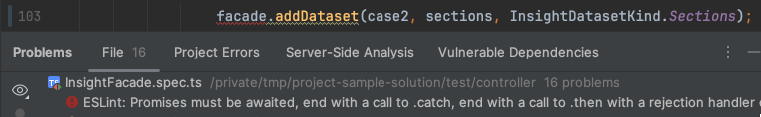

# Configuring Your IDE for Lint/Prettier

Configuring your IDE so that it works with static analysis tools will ensure that your development process is smooth (and saves you time!). For CPSC 310, we use two static analysis tools: [Prettier](https://prettier.io/docs/en/index.html), a code formatter, and [ESLint](https://eslint.org/), a linter, and these can both be integrated into several popular IDE's!

## IntelliJ & Webstorm

Configuring Prettier and Lint in Jetbrains-based IDEs (including IntelliJ and Webstorm) is striaghtforward:

* Prettier provides comprehensive documentation to [configure prettier](https://prettier.io/docs/en/webstorm) for these platforms.

* The Jetbrains documentation for [enabling automatic linting](https://www.jetbrains.com/help/webstorm/eslint.html#ws_js_eslint_activate) is also available.

When this is complete, the IDE should automatically highlight lint and formmating errors on save:



## Visual Studio Code (VSCode)

1. Install the [ESLint](https://marketplace.visualstudio.com/items?itemName=dbaeumer.vscode-eslint) and [Prettier](https://marketplace.visualstudio.com/items?itemName=esbenp.prettier-vscode) extensions in VSCode (`Settings -> Extensions`).

1. Execute `yarn install` in the terminal for your repository.

1. Add the following configuration to your personal settings by running the `Preferences: Open User Settings (JSON)` command in the Command Palette (Ctrl+Shift+P) within VSCode.
```json
{
	"editor.defaultFormatter": "esbenp.prettier-vscode",
	"eslint.useFlatConfig": false,
	"eslint.problems.shortenToSingleLine": true,
	"eslint.run": "onSave",
	"prettier.useTabs": true,
	"editor.formatOnPaste": true,
	"editor.formatOnSave": true,
	"prettier.prettierPath": "./node_modules/prettier"
}
```

This adds the ability for VSCode to format your code according to Prettier's guidelines, and highlight ESLint lint errors directly in your IDE:


During this process you may have to restart VSCode a couple of times to get the configuration fully activated.

